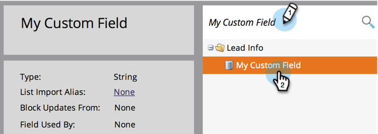

# 變更Marketo自訂欄位的類型 {#change-the-type-of-a-marketo-custom-field}

以下說明如何變更自訂欄位的欄位類型。

1. 前往 **管理** 的上界。

   

1. 按一下 **欄位管理**.

   

1. 尋找並選取所需欄位。

   

1. 在 **欄位動作** 下拉式清單，按一下 **變更類型**.

   

1. 選取新類型。

   >[!NOTE]
   >
   >無法更改分數和公式欄位。

   

1. 閱讀警告，然後按一下 **變更** 確認。

   

   >[!NOTE]
   >
   >您看到的警告訊息會依您從變更為/變更為的欄位類型而有所不同。

   >[!MORELIKETHIS]
   >
   >[在Marketo中建立自訂欄位](/help/marketo/product-docs/administration/field-management/create-a-custom-field-in-marketo.md)
