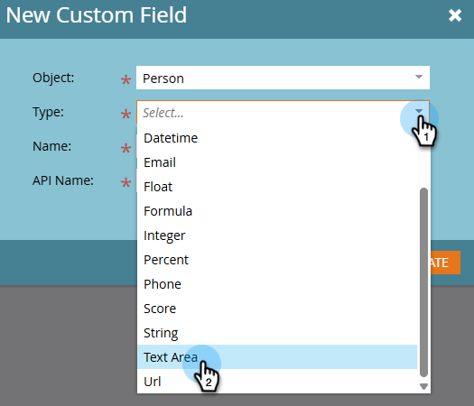

# 在Marketo中建立自訂欄位 {#create-a-custom-field-in-marketo}

如果您在Marketo Engage中需要新的自訂欄位來儲存/擷取資料，以下說明如何建立自訂欄位。

1. 前往 **[!UICONTROL 管理員]** 區域。

   

1. 按一下 **[!UICONTROL 欄位管理]**.

   

   >[!TIP]
   >
   >如果您希望欄位與CRM保持同步，請在CRM中建立它們，這些欄位將自動在Marketo中建立。

1. 按一下 **[!UICONTROL 新增自訂欄位]**.

   

1. 選擇欄位型別。 這會變更其在Marketo中智慧型清單和表單中的呈現方式。

   >[!TIP]
   >
   >檢視 [自訂欄位型別字彙表](/help/marketo/product-docs/administration/field-management/custom-field-type-glossary.md).

   

1. 輸入 [!UICONTROL 名稱] 您希望它在Marketo中顯示的方式。 此 [!UICONTROL API名稱] 會自動產生。 您可以加以調整，但一旦設定後即無法重新命名。 按一下 **[!UICONTROL 建立]** 完成時。

>[!CAUTION]
>
>欄位名稱的開頭不能為下列字元： **.&amp; +[]**

>[!NOTE]
>
>SOAP API和其他後端處理程式會使用API名稱。

您現在可以在表單、流程步驟和智慧清單中使用此自訂欄位！
