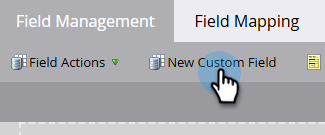

# 在Marketo中建立自訂欄位 {#create-a-custom-field-in-marketo}

如果您在Marketo Engage中需要新的自訂欄位來儲存/擷取資料，以下說明如何建立自訂欄位。

1. 移至&#x200B;**[!UICONTROL Admin]**&#x200B;區域。

   

1. 按一下「**[!UICONTROL Field Management]**」。

   

   >[!TIP]
   >
   >如果您希望欄位與CRM保持同步，請在CRM中建立欄位，系統會自動在Marketo中建立這些欄位。

1. 按一下「**[!UICONTROL New Custom Field]**」。

   

1. 選擇&#x200B;_[!UICONTROL Object]_。

   

   >[!NOTE]
   >
   >雖然您無法自行選取&#x200B;_公司_&#x200B;物件，但您可以聯絡[Marketo支援](https://nation.marketo.com/t5/support/ct-p/Support){target="_blank"}來要求它。

1. 選擇欄位&#x200B;_[!UICONTROL Type]_。 這會變更其在Marketo智慧清單和表單中的呈現方式。

   >[!TIP]
   >
   >請檢視[自訂欄位型別字彙表](/help/marketo/product-docs/administration/field-management/custom-field-type-glossary.md){target="_blank"}。

   

1. 輸入&#x200B;_[!UICONTROL Name]_，讓它在Marketo中顯示（會自動產生_[!UICONTROL API Name]_）。 請謹慎選擇，因為儲存後無法重新命名。 完成時，按一下&#x200B;**[!UICONTROL Create]**。

>[!CAUTION]
>
>欄位名稱不能以下列字元開頭： **. &amp; +[]**

>[!NOTE]
>
>此API名稱會用於SOAP API和其他後端程式。

您現在可以在表單、流程步驟和智慧列示中使用此自訂欄位！
