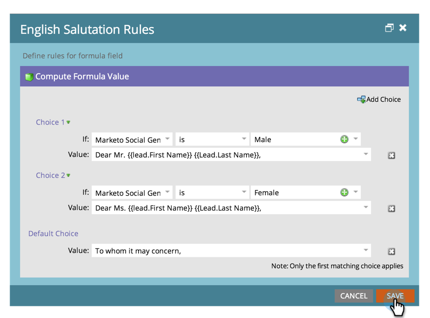

# 建立和使用串連字串（公式）欄位{#create-and-use-a-concatenated-string-formula-field}

您可以結合多個欄位的值，或使用「Marketo公式」欄位建立條件值。

1. 前往&#x200B;**Admin**，然後按一下「欄位管理」。****

   

1. 按一下「**新建自定義欄位**」。

   

1. 為&#x200B;**類型**&#x200B;選擇&#x200B;**公式**。

   

1. 為欄位輸入&#x200B;**名稱** ，然後按一下&#x200B;**建立**。

   

1. 查找並選擇公式欄位，然後按一下&#x200B;**編輯規則**。

   

1. 新增兩個選項，並像下方的螢幕擷取一樣加以定義。

   

   >[!TIP]
   >
   >進一步瞭解流程步驟[的Token](/help/marketo/product-docs/core-marketo-concepts/smart-campaigns/flow-actions/use-tokens-in-flow-steps.md)。

1. 現在，您可以在電子郵件中新增公式欄位作為代號。

   

>[!NOTE]
>
>公式欄位可用於著陸頁面、電子郵件和智慧型清單欄位（不匯出）。 含有公式欄位的電子郵件可以使用批次促銷活動傳送&#x200B;**not**。 請在此案例中使用[電子郵件指令碼Token](/help/marketo/product-docs/email-marketing/general/using-tokens/create-an-email-script-token.md)。

幹得好！ 現在，您有了一個聰明的領域，知道根據性別應包含哪些問候語。 玩得開心，盡情發揮創意。
