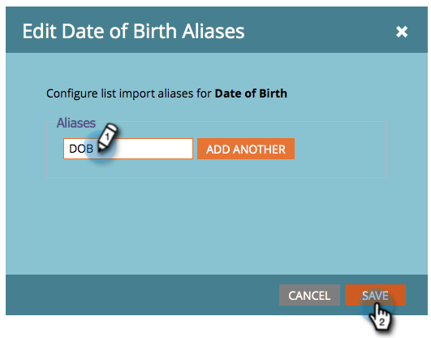

# 編輯清單導入的欄位別名 {#edit-field-aliases-for-list-import}

當您匯入具有未知標題的清單時，可以建立欄位別名，以便更輕鬆。 您也可以在欄位管理中編輯這些別名。 看看。

>[!NOTE]
>
>**需要管理權限**

1. 在 **管理**，按一下 **欄位管理**.

   

1. 查找並選擇要添加別名的欄位。

   

1. 在「欄位動作」下拉式清單中，按一下 **編輯導入別名**.

   

1. 輸入別名，然後按一下 **儲存**.

   

>[!TIP]
>
>按一下 **新增其他** 並輸入更多別名（如果需要）。

看！ 現在，如果您匯入的試算表中含有名為「DOB」的欄，Marketo會自動將其辨識為「出生日期」，並將資料匯入正確的欄位。

