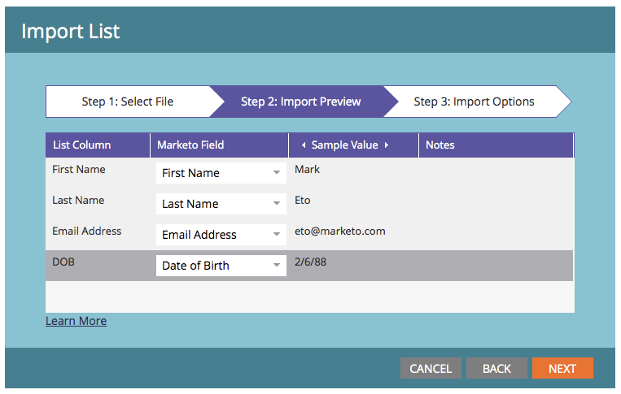

# 編輯清單匯入的欄位別名 {#edit-field-aliases-for-list-import}

當匯入具有未知標題的清單時，您可以建立欄位別名以簡化操作。 您也可以在欄位管理中編輯這些別名。 看看吧。

>[!NOTE]
>
>**需要管理員許可權**

1. 前往 **[!UICONTROL 管理員]** 區域。

   

1. 按一下 **[!UICONTROL 欄位管理]**.

   

1. 尋找並選取您要新增別名的欄位。

   

1. 在 **[!UICONTROL 欄位動作]** 下拉式清單，按一下 **[!UICONTROL 編輯匯入別名]**.

   

1. 輸入別名，然後按一下 **[!UICONTROL 儲存]**.

   

>[!TIP]
>
>按一下 **[!UICONTROL 新增其他]** 並視需要輸入更多別名。

看看這個！ 現在，如果您匯入的試算表含有名為「DOB」的欄，Marketo會自動將其識別為「出生日期」，並將資料匯入正確的欄位。

