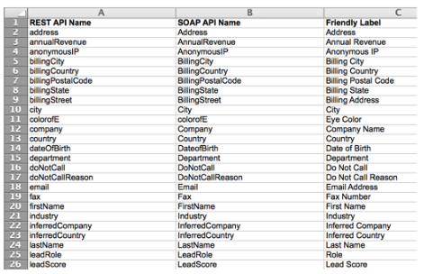

# 匯出所有Marketo API欄位名稱的清單 {#export-a-list-of-all-marketo-api-field-names}

如果您使用我們的 [!DNL SOAP API] 或 [!DNL Munchkin API] 您需要一份所有欄位及其API名稱的清單。 以下說明如何取得此清單。

>[!NOTE]
>
>**需要管理員許可權**

1. 前往 **[!UICONTROL 管理員]** 區域。

   

1. 按一下 **[!UICONTROL 欄位管理]**.

   

1. 按一下 **[!UICONTROL 匯出欄位名稱]** 以下載試算表。

   

很好！ 您現在有一個試算表，其中包含您所有欄位及其API名稱的清單。

>[!NOTE]
>
>MLM API名稱的字元限製為255。
