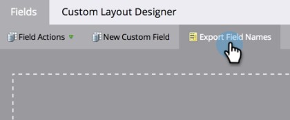

# 匯出所有 Marketo API 欄位名稱的清單 {#export-a-list-of-all-marketo-api-field-names}

如果您使用[!DNL SOAP API]或[!DNL Munchkin API]，則需要您所有欄位及其API名稱的清單。

>[!NOTE]
>
>**需要管理員權限**

1. 前往「**[!UICONTROL Admin]**」區域。

   

1. 按一下「**[!UICONTROL Field Management]**」。

   

1. 按一下&#x200B;**[!UICONTROL Export Field Names]**&#x200B;下載試算表。

   

您現在有一個試算表，其中包含您所有欄位及其API名稱的清單。

>[!NOTE]
>
>MLM API名稱的字元限製為255。
