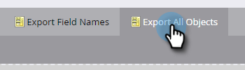
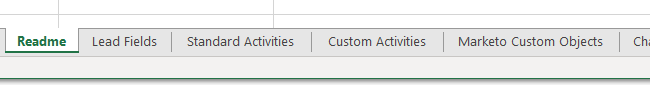

# 匯出所有物件後設資料 {#export-all-object-metadata}

此功能可讓您匯出所有物件及其中繼資料。

>[!NOTE]
>
>**需要管理員權限**

## 物件 {#objects}

* 潛在客戶欄位（人員/公司）
* Marketo 自訂物件
* 標準活動
* 自訂活動
* 管道
* 標記

## 匯出物件中繼資料 {#export-object-metadata}

1. 前往「**[!UICONTROL Admin]**」區域。

   

1. 按一下「**[!UICONTROL Field Management]**」。

   

1. 按一下「**[!UICONTROL Export All Objects]**」。

   

>[!NOTE]
>
>確認瀏覽器未封鎖Marketo的快顯視窗。

資料會匯出為CSV檔。

