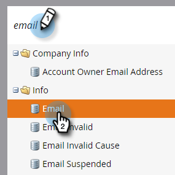
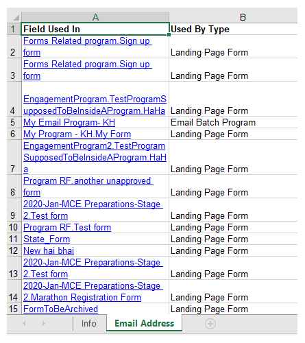

# 匯出欄位的使用者資料 {#export-used-by-data-for-a-field}

作為管理員，您可以匯出欄位的相關資產，以便將其取消連結委派給您的團隊。

>[!NOTE]
>
>**需要管理員權限**

1. 前往「**[!UICONTROL Admin]**」區域。

   

1. 按一下「**[!UICONTROL Field Management]**」。

   

1. 找到所需的欄位並加以選取。

   

1. 按一下「**[!UICONTROL Field Actions]**」下拉式選單，選取「**[!UICONTROL Export Used By]**」。

   

1. [!DNL Excel]檔案匯出。 開啟以檢視其內容。

   

   >[!TIP]
   >
   >每個相關資產都是連結，只要按一下，即可在Marketo中開啟。
