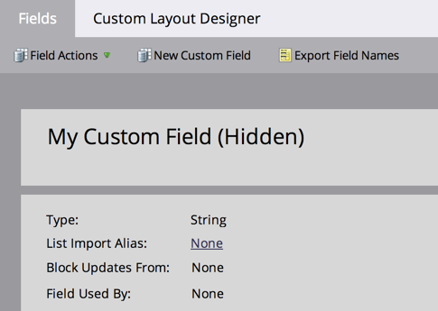

# 隱藏和取消隱藏欄位 {#hide-and-unhide-a-field}

如果您在Marketo Engage中不再需要欄位，您可以在UI中隱藏該欄位，使其不再顯示在應用程式中。

## 隱藏欄位 {#hide-a-field}

>[!NOTE]
>
>**需要管理員權限**

1. 前往「**[!UICONTROL Admin]**」區域。

   

1. 按一下「**[!UICONTROL Field Management]**」。

   

1. 找到欄位，選取它，然後在&#x200B;**[!UICONTROL Field Actions]**&#x200B;下按一下&#x200B;**[!UICONTROL Hide Field]**。

   

   >[!NOTE]
   >
   >* 為了隱藏欄位，不得將其與任何其他資產（包括已封存的資產）相關聯。 在隱藏之前，從所有智慧列示、流程步驟選擇、表單、電子郵件等中移除欄位。
   >* 您無法隱藏標準（系統）欄位。
   >* 您無法隱藏機會資訊欄位。

1. 按一下 **[!UICONTROL Hide]** 確認。

   

   現在您知道如何從Marketo使用者介面隱藏欄位了。

   

## 取消隱藏欄位 {#unhide-a-field}

1. 前往「**[!UICONTROL Admin]**」區域。

   

1. 按一下「**[!UICONTROL Field Management]**」。

   

1. 尋找並選取欄位。 在[!UICONTROL Field Actions]下拉式清單中，按一下&#x200B;**[!UICONTROL Unhide Field]**。

   

   現在您知道如何取消隱藏欄位，並讓它們再次可見。
