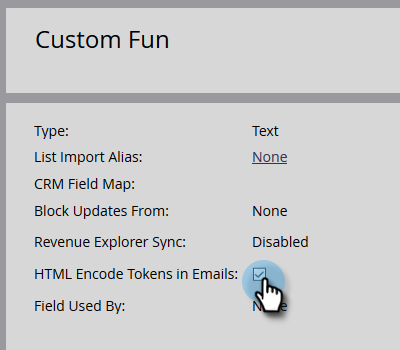

# 電子郵件中的HTML編碼Token {#html-encode-tokens-in-emails}

啟用/停用電子郵件中使用的個人和公司代號。

>[!NOTE]
>
>**需要管理員許可權**

>[!NOTE]
>
>編碼會將字元轉換為其HTML程式碼版本，以防止傳輸時產生混淆(即「&amp;」變更為 `&amp;`)。 如需詳細資訊，請洽詢您的網頁開發人員。

1. 前往 **[!UICONTROL 管理員]** 區域。

   

1. 按一下 **[!UICONTROL 欄位管理]**.

   

1. 尋找並選取所需的欄位。

   

1. 檢查 **[!UICONTROL 電子郵件中的HTML編碼Token]** 方塊以啟用，取消勾選以停用。

   

   就是這樣！ 您可以視需要為多個個別欄位執行此操作。
