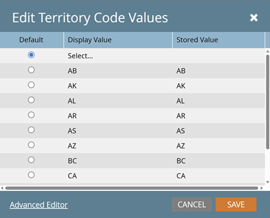

# 挑選清單管理 {#picklist-management}

挑選清單管理可讓您為欄位定義一組固定的值，以簡化Marketo Engage中的資料和工作流程管理。 在Marketo中，只能管理未對應到具有已定義選擇清單的CRM欄位的非文字欄位。 如果欄位對應到具有已定義挑選清單的CRM欄位，則必須在CRM中定義該欄位的值。

您可以從其「欄位管理」頁面檢視挑選清單的狀態。 欄位可能有下列其中一種挑選清單狀態：

* **Managed**：使用者已定義可自動建議用於此欄位的值集。 系統只會自動建議在欄位管理中定義的值。 如果刪除受管理的挑選清單，挑選清單狀態會回覆為欄位的初始值（非受管理的或內建的）。

* **Unmanaged**：未定義此欄位可能的值。 系統會根據資料庫中這些欄位中存在的值，自動建議值。

* **內建**：欄位具有系統定義的值清單，建議使用者使用。

* **CRM**：欄位具有由CRM系統（Salesforce.com或Microsoft Dynamics）定義的值，該值已同步至執行個體。

  

## 管理挑選清單 {#manage-picklist}

若要修改欄位的值，請移至&#x200B;**管理員** > **欄位管理**&#x200B;並選取所要的欄位。

按一下&#x200B;_欄位動作_&#x200B;下拉式清單，然後選取&#x200B;**管理挑選清單**。

在&#x200B;_管理挑選清單_&#x200B;對話方塊中，您可以新增、編輯或刪除值。 您也可以刪除Managed挑選清單，將欄位還原為其原始挑選清單狀態： _Unmanaged_&#x200B;或&#x200B;_Seeded_。

每個挑選清單專案都有顯示值和提交值。 顯示值是使用者在建置智慧清單、智慧行銷活動或表單時建議的值，而提交的值是儲存的值。 例如，您的「地區代碼」使用案例可能會建議地區全名（例如Alberta），同時儲存雙字母代碼(AB)。

## 自動建議 {#autosuggest}

啟用&#x200B;_受管理的挑選清單_&#x200B;設定時，篩選器、流程步驟選擇和變更資料值步驟將會自動從受管理的挑選清單建議值。 停用此設定時，只會建議非受管理的值。

### 在Managed和Unmanaged挑選清單之間切換 {#switching}

大部分的Marketo Engage訂閱都包含匯入Managed Picklists之前的資料。 若要使用智慧清單中的值或來自此非受管理版本選擇清單（例如，來自資料庫中記錄的全套值）的流程步驟，請切換智慧清單或行銷活動檢視中的「受管理的選擇清單」設定。 切換開啟時，只會顯示Managed挑選清單值。 關閉時，會使用unmanaged挑選清單，並根據資料庫中的現有值自動建議值。

## 表單挑選清單（選取型別欄位） {#form-picklists}

如同內建和CRM管理的挑選清單，使用選取欄位型別時，管理的挑選清單值會傳播至Forms。 針對具有受管理挑選清單的欄位，選取該欄位並將欄位型別設定為&#x200B;_選取_。

這會顯示為該欄位定義的一組Managed挑選清單值。

