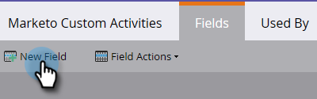
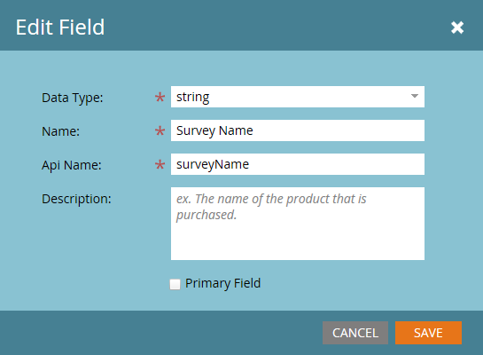

# 新增／編輯／刪除Marketo自訂活動欄位{#add-edit-delete-marketo-custom-activity-fields}

您可能需要新增、變更或甚至移除自訂活動欄位。 這是方法。

## 新增自訂活動欄位{#add-a-custom-activity-field}

1. 在「Marketo自訂活動」中，按一下「**欄位**」。

   

1. 選擇您要新增欄位的自訂活動。

   

1. 按一下「**新建欄位**」。

   

1. 選擇欄位的資料類型。

   

   >[!TIP]
   >
   >不確定要選擇什麼？ 我們能搞定你！ 所有可用的資料類型皆定義於[本文](/help/marketo/product-docs/administration/field-management/custom-field-type-glossary.md)。

1. 命名欄位。 Api名稱會自動填入。 完成後，按一下&#x200B;**保存**。

   

   就這樣！ 已添加新欄位。

## 編輯自訂活動欄位{#edit-a-custom-activity-field}

1. 在「Marketo自訂活動」中，按一下「**欄位**」。

   

1. 選取包含您要編輯之欄位的自訂活動。

   

1. 選擇要編輯的欄位，按一下&#x200B;**欄位操作**&#x200B;下拉式清單，然後選擇&#x200B;**編輯欄位**。

   

   此時會出現「編輯欄位」快顯視窗。 在此範例中，讓我們變更欄位的名稱。

   

1. 輸入新的名稱和Api名稱，然後按一下&#x200B;**保存**。

   

   >[!NOTE]
   >
   >編輯欄位時，Api名稱不會自動填入。 雖然欄位名稱和Api名稱不必相符，但建議您這麼做。

   >[!CAUTION]
   >
   >如果自訂活動從未發佈，您只能編輯「Api名稱」或將欄位變更為「主要」。 如果活動已發佈，則只能編輯欄位的名稱和可選說明。

   >[!NOTE]
   >
   >如果要更改「主要」欄位，必須先取消選擇現有欄位。

您的欄位現在已編輯！

## 刪除自訂活動欄位{#delete-a-custom-activity-field}

1. 在「Marketo自訂活動」中，按一下「**欄位**」。

   

1. 選擇包含您要刪除之欄位的自訂活動。

   

1. 選擇要刪除的欄位，按一下&#x200B;**欄位操作**&#x200B;下拉式清單，然後選擇&#x200B;**刪除欄位**。

   

   就是這麼簡單！
