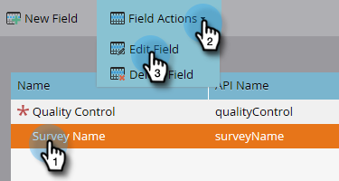

# 新增/編輯/刪除Marketo自訂活動欄位 {#add-edit-delete-marketo-custom-activity-fields}

您可能需要新增、變更，或甚至移除自訂活動欄位。 方法如下。

## 新增自訂活動欄位 {#add-a-custom-activity-field}

1. 前往 **[!UICONTROL 管理員]** 區域。

   

1. 按一下 **[!UICONTROL Marketo自訂活動]**.

   

1. 按一下 **[!UICONTROL 欄位]**.

   

1. 選取您要新增欄位的自訂活動。

   

1. 按一下 **[!UICONTROL 新欄位]**.

   

1. 選擇欄位的 [!UICONTROL 資料型別].

   

   >[!TIP]
   >
   >不確定要選取什麼專案？ 我們為您提供支援！ 所有可用的資料型別皆定義於 [本文](/help/marketo/product-docs/administration/field-management/custom-field-type-glossary.md).

1. 為欄位命名。 Api名稱會自動填入。 完成後，按一下 **[!UICONTROL 儲存]**.

   

   完成了！ 已新增您的新欄位。

## 編輯自訂活動欄位 {#edit-a-custom-activity-field}

1. 前往 **[!UICONTROL 管理員]** 區域。

   

1. 按一下 **[!UICONTROL Marketo自訂活動]**.

   

1. 按一下 **[!UICONTROL 欄位]**.

   

1. 選取包含要編輯之欄位的自訂活動。

   

1. 選取要編輯的欄位，按一下 **[!UICONTROL 欄位動作]** 下拉式清單，然後選取 **[!UICONTROL 編輯欄位]**.

   

   「編輯欄位」快顯視窗隨即出現。 在此範例中，讓我們變更欄位名稱。

   

1. 輸入新名稱和Api名稱，然後按一下 **[!UICONTROL 儲存]**.

   

   >[!NOTE]
   >
   >編輯欄位時不會自動填入Api名稱。 欄位名稱和Api名稱不一定必須相符，我們建議您這麼做。

   >[!CAUTION]
   >
   >如果自訂活動尚未發佈，您只能編輯API名稱或將欄位變更為「主要」。

   >[!NOTE]
   >
   >如果要變更哪個欄位是「主要」，必須先取消選取現有的欄位。

您的欄位現在已編輯！

## 刪除自訂活動欄位 {#delete-a-custom-activity-field}

1. 前往 **[!UICONTROL 管理員]** 區域。

   

1. 按一下 **[!UICONTROL Marketo自訂活動]**.

   

1. 按一下 **[!UICONTROL 欄位]**.

   

1. 選取包含您要刪除之欄位的自訂活動。

   

1. 選取要刪除的欄位，按一下 **[!UICONTROL 欄位動作]** 下拉式清單，然後選取 **[!UICONTROL 刪除欄位]**.

   
