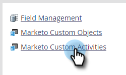

# 自訂活動中繼資料匯出 {#custom-activity-metadata-export}

請依照下列步驟匯出您的自訂活動中繼資料結構。

1. 在「我的Marketo」中，按一下 **[!UICONTROL 管理員]**.

   

1. 按一下 **[!UICONTROL Marketo自訂活動]**.

   

1. 選取您要匯出的Marketo自訂活動。

   

1. 按一下 **[!UICONTROL 自訂活動動作]** 下拉式清單並選取 **[!UICONTROL 匯出活動]**.

   

>[!NOTE]
>
>自訂活動必須處於已核准狀態才能匯出。

您現在有一個試算表，內含三個標籤中的自訂活動結構。
