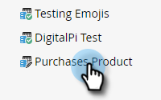
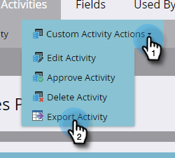

# 自訂活動後設資料匯出 {#custom-activity-metadata-export}

請依照下列步驟匯出您的自訂活動中繼資料結構。

1. 在「我的Marketo」中，按一下&#x200B;**[!UICONTROL Admin]**。

   

1. 按一下「**[!UICONTROL Marketo Custom Activities]**」。

   

1. 選取您要匯出的Marketo自訂活動。

   

1. 按一下「**[!UICONTROL Custom Activity Actions]**」下拉式選單，選取「**[!UICONTROL Export Activity]**」。

   

>[!NOTE]
>
>自訂活動必須處於已核准狀態才能匯出。

您現在有一個試算表，內含三個索引標籤的自訂活動結構。
