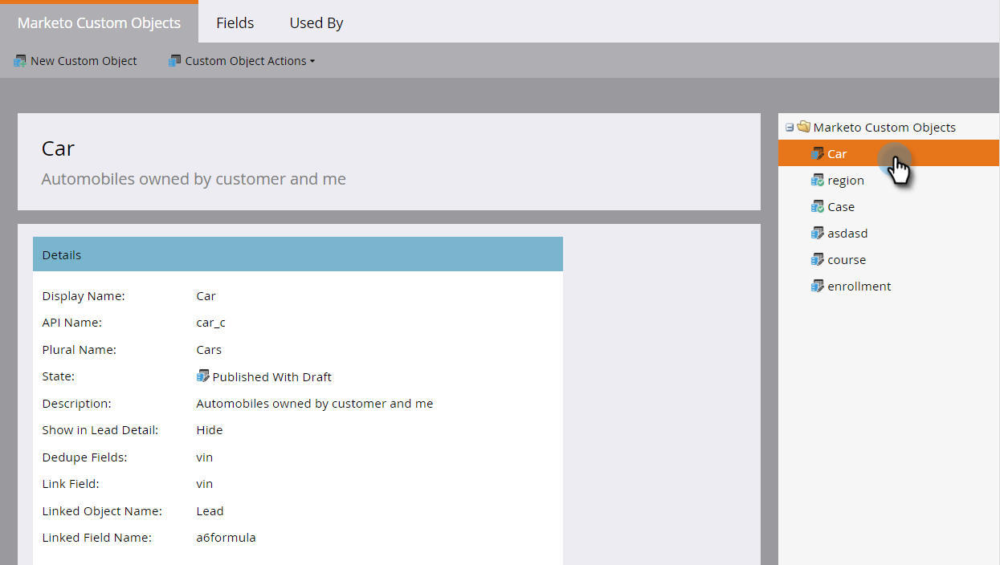

# 新增行銷至自訂物件欄位{#add-marketo-custom-object-fields}

在建立自訂物件後，您需要新增欄位至物件，以符合您的業務需求。

欄位可定義自訂物件使用的特定資訊。 連結欄位有特殊工作，可連接自訂物件，並在[個別文章](/help/marketo/product-docs/administration/marketo-custom-objects/add-marketo-custom-object-link-fields.md)中涵蓋。

1. 按一下&#x200B;**管理員**，在&#x200B;**資料庫管理**&#x200B;中，選擇&#x200B;**行銷商定制對象**。

   

1. 選擇要在右側添加欄位的對象。

   

1. 在&#x200B;**欄位**&#x200B;頁籤中，按一下&#x200B;**新欄位**。

   

   >[!NOTE]
   >
   >當您建立自訂物件時，Marketo會自動建立上述三個欄位。 Market可自動管理這些欄位，而您無法編輯或刪除欄位。

1. 輸入顯示名稱和說明。

   

   >[!NOTE]
   >
   >API名稱只能編輯，直到獲得批准。

1. 現在，從清單中選擇適當的資料類型。

   

1. 如果要將新欄位用作唯一標識符，請將「重複資料消除」滑塊拉到上面。 按一下&#x200B;**保存**&#x200B;以完成。

   

   >[!TIP]
   >
   >重複資料消除欄位可用於檢索、更新或刪除自定義對象。 每個自定義對象定義至少必須包含一個（且不超過三個）重複資料消除欄位。

1. 新增您需要的任何其他欄位。

   >[!NOTE]
   >
   >如果您要建立一對多結構，則需要新增「連結」欄位至自訂物件。 對於多對多結構，您不需要自訂物件中的連結欄位，但必須在中介物件中新增兩個連結欄位。 如需自訂物件類型的詳細資訊，請參閱[新增行銷至自訂物件連結欄位](/help/marketo/product-docs/administration/marketo-custom-objects/add-marketo-custom-object-fields.md)以建立連結欄位，以及[瞭解行銷至自訂物件](/help/marketo/product-docs/administration/marketo-custom-objects/understanding-marketo-custom-objects.md)。

>[!MORELIKETHIS]
>
>* [新增行銷至自訂物件連結欄位](/help/marketo/product-docs/administration/marketo-custom-objects/add-marketo-custom-object-link-fields.md)
>* [編輯和刪除行銷人員自訂物件](/help/marketo/product-docs/administration/marketo-custom-objects/edit-and-delete-a-marketo-custom-object.md)
>* [編輯和刪除Marketo自訂物件欄位](/help/marketo/product-docs/administration/marketo-custom-objects/edit-and-delete-marketo-custom-object-fields.md)
>* [瞭解Marketo自訂物件](/help/marketo/product-docs/administration/marketo-custom-objects/understanding-marketo-custom-objects.md)

