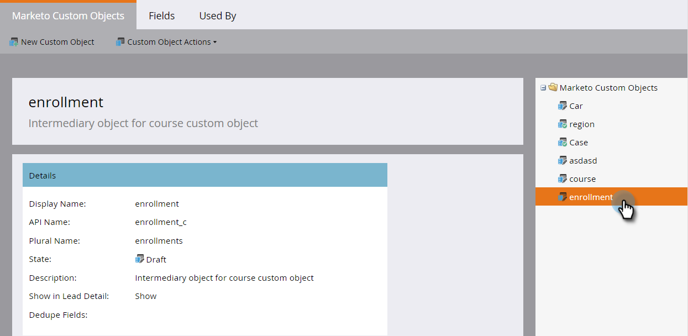

# 新增Marketo自訂物件連結欄位{#add-marketo-custom-object-link-fields}

建立自定義對象時，必須提供連結欄位，以將自定義對象記錄連接到正確的父記錄。

* 對於一對多自訂結構，請使用自訂物件中的連結欄位，將其連接至個人或公司。
* 對於多對多結構，您使用兩個連結欄位，這些欄位會與個別建立的中介物件（也是自訂物件類型）連接。 一個連結會連結至資料庫中的人員或公司，另一個連結會連結至自訂物件。 在這種情況下，連結欄位不位於自訂物件本身。

## 為一對多結構{#create-a-link-field-for-a-one-to-many-structure}建立連結欄位

以下說明如何在一對多結構的自訂物件中建立連結欄位。

1. 按一下&#x200B;**Admin**，在&#x200B;**資料庫管理**&#x200B;中，選擇&#x200B;**Marketo自定義對象**。

   

1. 在清單中選擇自定義對象。

   

1. 在&#x200B;**欄位**&#x200B;頁籤中，按一下&#x200B;**新欄位**。

   

1. 命名連結欄位並新增選用說明。 請務必選取「連結」資料類型。

   

   >[!CAUTION]
   >
   >一旦批准自定義對象，您將無法返回並建立、編輯或刪除連結或重複資料消除欄位。

1. 選擇連結對象是銷售線索（人員）還是公司。

   

   >[!NOTE]
   >
   >如果您選擇銷售機會，您會在清單中看到Id、電子郵件地址和任何自訂欄位。
   >
   >如果您選擇公司，清單中會顯示Id和任何自訂欄位。

1. 選擇要連接的連結欄位作為新欄位的父欄位。

   

   >[!NOTE]
   >
   >連結欄位僅支援字串欄位類型。

1. 按一下「保存」。****

   

## 為多對多結構{#create-a-link-field-for-a-many-to-many-structure}建立連結欄位

以下說明如何在中介物件中建立連結欄位，以便用於多對多結構。

>[!PREREQUISITES]
>
>您必須已經建立了中間對象和要連結到的任何自定義對象。

1. 按一下&#x200B;**Admin**，在&#x200B;**資料庫管理**&#x200B;中，選擇&#x200B;**Marketo自定義對象**。

   

1. 選擇要向中介對象添加欄位。

   

1. 在&#x200B;**欄位**&#x200B;頁籤中，按一下&#x200B;**新欄位**。

   

1. 您必須建立兩個連結欄位。 一次建立一個。 首先，為資料庫清單成員的欄位命名（例如leadID）。 新增可選說明。 請務必選取連結資料類型。

   

   >[!CAUTION]
   >
   >一旦批准自定義對象，您將無法返回並建立、編輯或刪除連結或重複資料消除欄位。

1. 從資料庫中選擇連結對象，在本例中為Lead。

   

1. 選取您要連線至的連結欄位，在本例中為Id。

   

   >[!NOTE]
   >
   >連結欄位僅支援字串欄位類型。

1. 按一下「保存」。****

   

1. 對自訂物件的第二個連結重複此程式，在本範例中為courseID。 「連結物件名稱」將為course,「連結欄位」將為courseID。 由於您已經建立並批准了課程自定義對象，因此下拉菜單中提供了這些選項。

   

1. 建立您要在中介物件中使用的任何其他欄位，例如enrollmentID或grade。

## 使用自訂物件{#using-custom-objects}

下一步是在智慧型促銷活動的篩選器中使用這些自訂物件。 透過多對多關係，您可以選擇多個人員／公司和多個自訂物件。 在以下範例中，您資料庫中符合這些條件的任何人都會列出。 coursename欄位來自課程定制對象，註冊級別來自中間對象。

>[!MORELIKETHIS]
>
>* [新增Marketo自訂物件欄位](/help/marketo/product-docs/administration/marketo-custom-objects/add-marketo-custom-object-fields.md)
>* [編輯和刪除Marketo自定義對象](/help/marketo/product-docs/administration/marketo-custom-objects/edit-and-delete-a-marketo-custom-object.md)
>* [瞭解Marketo自訂物件](/help/marketo/product-docs/administration/marketo-custom-objects/understanding-marketo-custom-objects.md)
>* [編輯和刪除Marketo自定義對象欄位](/help/marketo/product-docs/administration/marketo-custom-objects/edit-and-delete-marketo-custom-object-fields.md)

