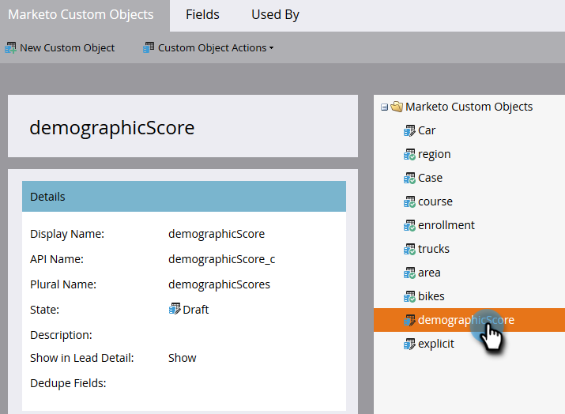

# 核准自訂物件 {#approve-a-custom-object}

您必須先核准自訂物件，才能使用它。 新自訂物件與您已編輯的物件的程式稍有不同。

## 核准新的自訂物件 {#approve-a-new-custom-object}

您已建立全新的自訂物件。 以下說明核准方式。

1. 前往 **[!UICONTROL 管理員]** 區域。

   

1. 按一下 **[!UICONTROL Marketo自訂物件]**.

   

1. 選取處於草稿狀態的物件。

   

1. 按一下 **[!UICONTROL 自訂物件動作]** 下拉式清單並選取 **[!UICONTROL 核准物件]**.

   

1. 狀態變更為 [!UICONTROL 已核准].

   

   >[!NOTE]
   >
   >中使用的自訂物件 _一對多結構_ 必須至少有一個要核准的重複資料刪除欄位、連結欄位、連結物件名稱和連結欄位名稱。
   >
   >中使用的自訂物件 _多對多結構_ **不會** 核準時需要連結欄位、連結物件名稱或連結欄位名稱（因為它們位在中間物件中）。
   >
   >用作的自訂物件 _中介物件_ 需要連結欄位、連結物件名稱和連結欄位名稱，但 **不會** 需要重複資料刪除欄位。
   >
   >另請參閱 [瞭解Marketo自訂物件](/help/marketo/product-docs/administration/marketo-custom-objects/understanding-marketo-custom-objects.md) 以取得詳細資訊。

完成了！ 現在，您可以在篩選器和觸發器的限制中選取自訂物件，以用於行銷活動。

## 核准已編輯的自訂物件 {#approve-an-edited-custom-object}

編輯已核准的自訂物件後，您必須核准草稿才能將自訂物件恢復為已核准狀態。

1. 當您編輯已核准的自訂物件時，它會收到 [!UICONTROL 已核准並草稿] 州別。

   

1. 當您準備好核准草稿時，請按一下 **[!UICONTROL 自訂物件動作]** 下拉式清單並選取 **[!UICONTROL 核准物件]**.

   

1. 預覽會顯示草稿中變更的專案。 按一下 **[!UICONTROL 核准]**.

   
