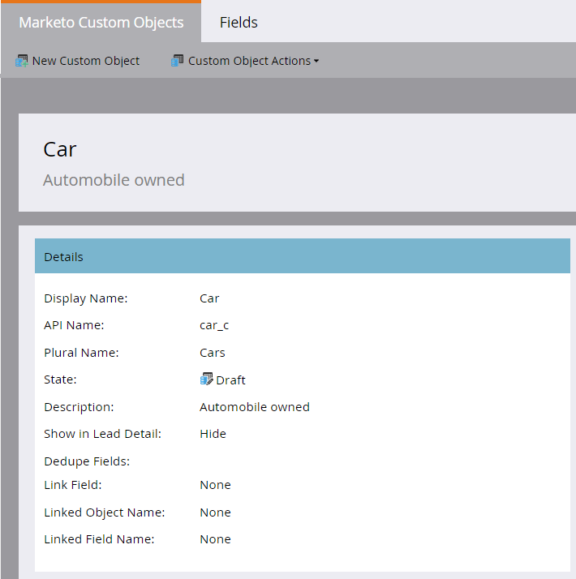

# 建立Marketo自定義對象{#create-marketo-custom-objects}

使用Marketo的自訂物件來追蹤您業務的特定量度。 從汽車到課程，一切皆有可能——不論您想在Marketo做什麼樣的模特，來進行宣傳活動。

>[!NOTE]
>
>您可以設定自訂物件，以一對多或多對多的方式運作。 建立初始對象的方式相同，但在開始向對象添加欄位時，步驟不同。 如需詳細資訊，請參閱[瞭解Marketo自訂物件](/help/marketo/product-docs/administration/marketo-custom-objects/understanding-marketo-custom-objects.md)。

>[!NOTE]
>
>一旦批准自定義對象，就不能建立、編輯或刪除連結或重複資料刪除欄位。

## 為一對多結構{#create-a-custom-object-for-a-one-to-many-structure}建立自定義對象

此範例顯示Car自訂物件，用於一對多結構。 之後，您將建立課程自訂物件和中介物件，以用於多對多結構。

1. 按一下&#x200B;**Admin**，在&#x200B;**資料庫管理**&#x200B;中選擇&#x200B;**Marketo自定義對象**。

   

1. 按一下「**新建自定義對象**」。

   

   >[!NOTE]
   >
   >「Marketo自訂物件」標籤會在右側顯示所有自訂物件，以及任何已核准物件的詳細資訊，包括記錄數和最近更新的欄位。

1. 輸入顯示名稱。 API名稱和複數名稱會自動填入。 輸入說明（可選）。

   

   >[!NOTE]
   >
   >在建立欄位時，您可以編輯這些欄位，但在保存這些欄位後，您只能編輯「複數名」欄位和&#x200B;**「在銷售線索中顯示」滑塊。**

1. 如果要在「銷售線索資料庫」頁上查看自定義對象資料，請將&#x200B;**「在銷售線索詳細資訊中顯示」滑塊拉到以顯示**「顯示」。 ****&#x200B;按一下&#x200B;**保存**。

   

1. 自訂物件資訊會顯示您輸入的內容。 請注意，它處於「草稿」狀態。

   

   下一步是將欄位添加到[中，以構建自定義對象](/help/marketo/product-docs/administration/marketo-custom-objects/add-marketo-custom-object-fields.md)。

   >[!NOTE]
   >
   >您只能透過清單匯入或[API](https://developers.marketo.com/documentation/rest/)填入「Marketo自訂物件」。

## 為多對多結構{#create-a-custom-object-for-a-many-to-many-structure}建立自定義對象

此範例顯示課程自訂物件，您將用它來建立人員／公司與課程之間的多對多關係。 完成後，您將建立一個中間對象，將其連接到資料庫中的人員或公司。

>[!NOTE]
>
>對於多對多關係，您不需要在自訂物件中建立連結。 相反地，您將新增兩個連結至中介物件（請參閱下方）。

1. 按一下&#x200B;**Admin**，在&#x200B;**資料庫管理**&#x200B;中選擇&#x200B;**Marketo自定義對象**。

   

1. 按一下「**新建自定義對象**」。

   

1. 輸入顯示名稱。 API名稱和複數名稱會自動填入。 輸入說明（可選）。

   

   >[!NOTE]
   >
   >在建立欄位時，您可以編輯這些欄位，但在保存這些欄位後，您只能編輯「複數名」欄位和&#x200B;**「在銷售線索中顯示」滑塊。**

1. 如果要在「銷售線索資料庫」頁上查看自定義對象資料，請將&#x200B;**「在銷售線索詳細資訊中顯示」滑塊拉到以顯示**「顯示」。 ****&#x200B;按一下&#x200B;**保存**。

   

1. 自訂物件資訊會顯示您輸入的內容。 請注意，它處於「草稿」狀態。

   

   >[!NOTE]
   >
   >您只能透過清單匯入或[API](https://developers.marketo.com/documentation/rest/)填入「Marketo自訂物件」。

下一步是您建立中介物件（請參閱下面）。 但在此之前，您必須建立欄位以連結至它。

## 建立中間對象{#create-an-intermediary-object}

使用中介物件將自訂物件連接至個人或公司。 在此示例中，它用於將課程中的課程自定義對象連接到資料庫中的人員或公司。

>[!NOTE]
>
>您不需要為一對多自訂物件結構建立中介物件。

1. 按一下&#x200B;**Admin**，在&#x200B;**資料庫管理**&#x200B;中，選擇&#x200B;**Marketo自定義對象**。

   

1. 按一下「**新建自定義對象**」。

   

1. 輸入顯示名稱。 API名稱和複數名稱會自動填入。 輸入說明（可選）。

   

   >[!NOTE]
   >
   >您可以在建立欄位時編輯這些欄位，但儲存欄位後，您只能編輯「複數名稱」欄位和「在銷售線索中顯示詳細資料」滑桿。

1. 如果要在「銷售線索資料庫」頁上查看自定義對象資料，請將&#x200B;**「在銷售線索詳細資訊中顯示」滑塊拉到以顯示**「顯示」。 ****&#x200B;按一下&#x200B;**保存**。

   

1. 自訂物件資訊會顯示您輸入的內容。 請注意，它處於「草稿」狀態。

   下一步是，您將[新增連結欄位](/help/marketo/product-docs/administration/marketo-custom-objects/add-marketo-custom-object-link-fields.md)，將中介物件連接至人員／公司和自訂物件。

>[!MORELIKETHIS]
>
>* [新增Marketo自訂物件欄位](/help/marketo/product-docs/administration/marketo-custom-objects/add-marketo-custom-object-fields.md)
>* [新增Marketo自訂物件連結欄位](/help/marketo/product-docs/administration/marketo-custom-objects/add-marketo-custom-object-link-fields.md)
>* [瞭解Marketo自訂物件](/help/marketo/product-docs/administration/marketo-custom-objects/understanding-marketo-custom-objects.md)

