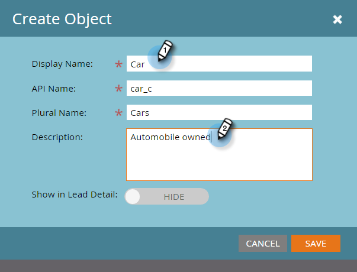
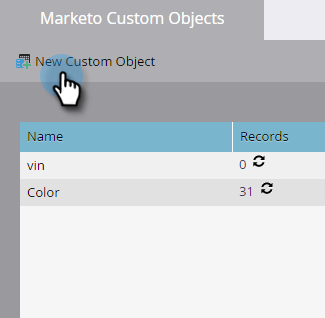

# 建立Marketo自訂物件 {#create-marketo-custom-objects}

在Marketo中使用自訂物件來追蹤您企業的特定量度。 這可以是任何專案，從汽車到課程 — 無論您想要在Marketo中建立何種模型，以執行行銷活動。

>[!NOTE]
>
>您可以設定自訂物件以一對多或多對多方式運作。 您以相同的方式建立初始物件，但當您開始將欄位新增至物件時，步驟會不同。 另請參閱  [瞭解Marketo自訂物件](/help/marketo/product-docs/administration/marketo-custom-objects/understanding-marketo-custom-objects.md) 以取得詳細資訊。

>[!NOTE]
>
>自訂物件獲得核准後，您就無法建立、編輯或刪除連結或重複資料刪除欄位。

## 建立一對多結構的自訂物件 {#create-a-custom-object-for-a-one-to-many-structure}

此範例顯示Car自訂物件，用於一對多結構。 稍後您將建立課程自訂物件和中介物件，以用於多對多結構。

1. 前往 **[!UICONTROL 管理員]** 區域。

   

1. 按一下 **[!UICONTROL Marketo自訂物件]**.

   

1. 按一下 **[!UICONTROL 新增自訂物件]**.

   

   >[!NOTE]
   >
   >此 [!UICONTROL Marketo自訂物件] tab會在右側顯示所有自訂物件，以及任何已核准物件的詳細資訊，包括最近更新的記錄數量和欄位。

1. 輸入 [!UICONTROL 顯示名稱]. 此 [!UICONTROL API名稱] 和 [!UICONTROL 複數名稱] 會自動填入。 輸入 [!UICONTROL 說明] （選擇性）。

   

   >[!NOTE]
   >
   >您可以在建立這些欄位時加以編輯，但在儲存後，您只能編輯 [!UICONTROL 複數名稱] 欄位和 **[!UICONTROL 在潛在客戶詳細資訊中顯示]** 滑桿。

1. 提取 **[!UICONTROL 在潛在客戶詳細資訊中顯示]** 滑桿移過以顯示 **[!UICONTROL 顯示]** 如果您想要檢視「資料庫」頁面上的自訂物件資料。 按一下 **[!UICONTROL 儲存]**.

   

1. 自訂物件資訊會顯示您輸入的內容。 請注意，它處於「草稿」狀態。

   

   下一步是將欄位新增至 [建置您的自訂物件](/help/marketo/product-docs/administration/marketo-custom-objects/add-marketo-custom-object-fields.md).

   >[!NOTE]
   >
   >Marketo您只能透過清單匯入或 [API](https://developers.marketo.com/documentation/rest/).

## 建立多對多結構的自訂物件 {#create-a-custom-object-for-a-many-to-many-structure}

此範例顯示一個課程自訂物件，您將用來在人員/公司與課程之間建立多對多關係。 完成後，您將建立中介物件以將其連線到資料庫中的人員或公司。

>[!NOTE]
>
>對於多對多關係，您不需要在自訂物件中建立連結。 而是要新增兩個連結至中介物件（請參閱下文）。

1. 前往 **[!UICONTROL 管理員]** 區域。

   

1. 按一下 **[!UICONTROL Marketo自訂物件]**.

   

1. 按一下 **[!UICONTROL 新增自訂物件]**.

   

1. 輸入 [!UICONTROL 顯示名稱]. 此 [!UICONTROL API名稱] 和 [!UICONTROL 複數名稱] 會自動填入。 輸入 [!UICONTROL 說明] （選擇性）。

   

   >[!NOTE]
   >
   >您可以在建立這些欄位時加以編輯，但在儲存後，您只能編輯 [!UICONTROL 複數名稱] 欄位和 **[!UICONTROL 在潛在客戶詳細資訊中顯示]** 滑桿。

1. 提取 **[!UICONTROL 在潛在客戶詳細資訊中顯示]** 滑桿移過以顯示 **[!UICONTROL 顯示]** 如果您想要檢視「資料庫」頁面上的自訂物件資料。 按一下 **[!UICONTROL 儲存]**.

   

1. 自訂物件資訊會顯示您輸入的內容。 請注意，它處於「草稿」狀態。

   

   >[!NOTE]
   >
   >Marketo您只能透過清單匯入或 [API](https://developers.marketo.com/documentation/rest/).

下一步是建立您的中介物件（請參閱下文）。 但在那之前，您需要建立一個欄位以與之連結。

## 建立中介物件 {#create-an-intermediary-object}

使用中介物件將自訂物件連線至人員或公司。 在此範例中，它用於將課程自訂物件中的課程連線到資料庫中的人員或公司。

>[!NOTE]
>
>您不需要為一對多自訂物件結構建立中介物件。

1. 前往 **[!UICONTROL 管理員]** 區域。

   

1. 按一下 **[!UICONTROL Marketo自訂物件]**.

   

1. 按一下 **[!UICONTROL 新增自訂物件]**.

   

1. 輸入 [!UICONTROL 顯示名稱]. 此 [!UICONTROL API名稱] 和 [!UICONTROL 複數名稱] 會自動填入。 輸入 [!UICONTROL 說明] （選擇性）。

   

   >[!NOTE]
   >
   >您可以在建立這些欄位時加以編輯，但在儲存後，您只能編輯 [!UICONTROL 複數名稱] 欄位和 [!UICONTROL 在潛在客戶詳細資訊中顯示] 滑桿。

1. 提取 **[!UICONTROL 在潛在客戶詳細資訊中顯示]** 滑桿移過以顯示 **顯示** 如果您想要檢視「資料庫」頁面上的自訂物件資料。 按一下 **儲存**.

   

1. 自訂物件資訊會顯示您輸入的內容。 請注意，它處於「草稿」狀態。

   下一個步驟是讓您 [新增連結欄位](/help/marketo/product-docs/administration/marketo-custom-objects/add-marketo-custom-object-link-fields.md) 將您的中介物件連線至人員/公司和自訂物件。

>[!MORELIKETHIS]
>
>* [新增Marketo自訂物件欄位](/help/marketo/product-docs/administration/marketo-custom-objects/add-marketo-custom-object-fields.md)
>* [新增Marketo自訂物件連結欄位](/help/marketo/product-docs/administration/marketo-custom-objects/add-marketo-custom-object-link-fields.md)
>* [瞭解Marketo自訂物件](/help/marketo/product-docs/administration/marketo-custom-objects/understanding-marketo-custom-objects.md)

