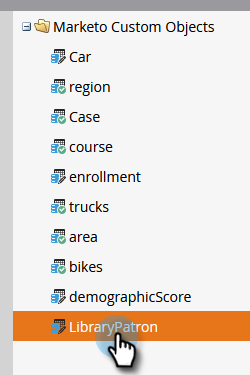
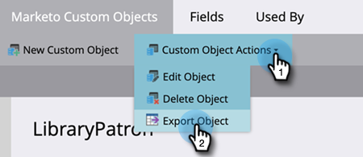

# 自訂物件中繼資料匯出 {#custom-object-metadata-export}

如果您使用的是我們的SOAP API或Munchkin API，則可匯出自訂物件中繼資料結構。 這裡是怎麼弄到的。

>[!AVAILABILITY]
>
>並非所有客戶都購買過此功能。 如需詳細資訊，請連絡您的客戶成功經理。

1. 在「我的Marketo」中，按一下 **管理**.

   

1. 按一下 **Marketo自訂物件**.

   

1. 選取您要匯出的Marketo自訂物件。

   

1. 按一下 **自訂物件動作** 下拉式清單並選取 **導出對象**.

   

>[!NOTE]
>
>自訂物件必須處於已核准狀態才能匯出。

您現在有一個試算表，內含自訂物件的結構描述，橫跨三個標籤。

