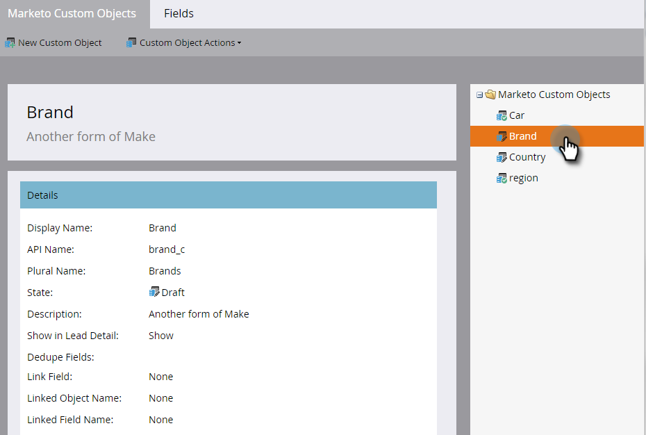

# 編輯和刪除Marketo自訂物件 {#edit-and-delete-a-marketo-custom-object}

>[!NOTE]
>
>批准自定義對象後，您就無法建立、編輯或刪除連結或重複資料刪除欄位。

## 編輯自訂物件 {#edit-a-custom-object}

使用「自定義對象操作」菜單可編輯或刪除自定義對象。

1. 前往 **管理** 的上界。

   

1. 按一下 **Marketo自訂物件**.

   

1. 在右側選取您要編輯的自訂物件。

   

1. 按一下 **自訂物件動作** 按一下 **編輯對象**.

   

1. 進行所需的變更。 如果要在「銷售線索詳細資訊」頁面上顯示對象，請將滑桿拖動到上面。 按一下 **儲存**.

   

1. 請務必核准 [已編輯的對象](/help/marketo/product-docs/administration/marketo-custom-objects/approve-a-custom-object.md).

## 刪除自訂物件 {#delete-a-custom-object}

刪除自訂物件很容易，但您必須小心。 自定義對象可以連接到其他對象或智慧清單。 所以，Marketo會先警告您，再讓您按一下 **刪除**.

>[!CAUTION]
>
>刪除自訂物件後，便無法還原該物件。

1. 前往 **管理** 的上界。

   

1. 按一下 **Marketo自訂物件**.

   

1. 選擇要刪除的對象。

   

1. 按一下 **自訂物件動作** 選取 **刪除對象**.

   

   >[!TIP]
   >
   >您也可以以滑鼠右鍵按一下物件，然後選取 **刪除對象**.

1. 如果自訂物件為草稿形式，但尚未核准，您會收到此警告。 如果確定，請按一下 **刪除**.

   

1. 如果自訂物件已獲核准，則刪除該物件的風險較大。 你會得到更嚴厲的警告。 輸入 **我理解**，檢查 **無法還原** 核取方塊，然後按一下 **刪除**.

   

   >[!NOTE]
   >
   >如果自定義對象連結到中間對象，則必須先刪除中間對象。

>[!MORELIKETHIS]
>
>[核准自訂物件](/help/marketo/product-docs/administration/marketo-custom-objects/approve-a-custom-object.md)
