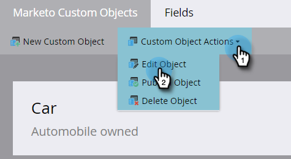

# 編輯和刪除Marketo自訂物件 {#edit-and-delete-a-marketo-custom-object}

>[!NOTE]
>
>自訂物件獲得核准後，您就無法建立、編輯或刪除連結或重複資料刪除欄位。

## 編輯自訂物件 {#edit-a-custom-object}

使用「自訂物件動作」選單來編輯或刪除自訂物件。

1. 前往 **[!UICONTROL 管理員]** 區域。

   

1. 按一下 **[!UICONTROL Marketo自訂物件]**.

   

1. 在右側選取您要編輯的自訂物件。

   

1. 按一下 **[!UICONTROL 自訂物件動作]** 標籤並按一下 **[!UICONTROL 編輯物件]**.

   

1. 進行所需的變更。 如果您想要在「銷售機會詳細資訊」頁面上顯示物件，請將滑桿拖曳過去。 按一下 **[!UICONTROL 儲存]**.

   

1. 請務必核准 [已編輯的物件](/help/marketo/product-docs/administration/marketo-custom-objects/approve-a-custom-object.md).

## 刪除自訂物件 {#delete-a-custom-object}

刪除自訂物件很容易，但您需要小心。 自訂物件可以連線到其他物件或智慧清單。 因此，Marketo會在您點按之前警告您 **[!UICONTROL 刪除]**.

>[!CAUTION]
>
>刪除自訂物件後，您無法還原該物件。

1. 前往 **[!UICONTROL 管理員]** 區域。

   

1. 按一下 **[!UICONTROL Marketo自訂物件]**.

   

1. 選取您要刪除的物件。

   

1. 按一下 **[!UICONTROL 自訂物件動作]** 並選取 **[!UICONTROL 刪除物件]**.

   

   >[!TIP]
   >
   >您也可以以滑鼠右鍵按一下物件並選取 **[!UICONTROL 刪除物件]**.

1. 如果自訂物件為草稿形式，且尚未核准，您將會收到此警告。 如果您確定，請按一下 **[!UICONTROL 刪除]**.

   

1. 如果自訂物件已經核准，則刪除它會有更大的風險。 因此，您會收到更嚴厲的警告。 輸入 **[!UICONTROL 我瞭解]**，檢查 **[!UICONTROL 無法還原]** 核取方塊，然後按一下 **[!UICONTROL 刪除]**.

   

   >[!NOTE]
   >
   >如果自訂物件連結至中介物件，您必須先刪除中介物件。

>[!MORELIKETHIS]
>
>[核准自訂物件](/help/marketo/product-docs/administration/marketo-custom-objects/approve-a-custom-object.md)
