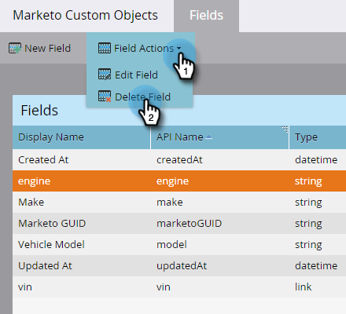

# 編輯和刪除 Marketo 自訂物件欄位 {#edit-and-delete-marketo-custom-object-fields}

## 編輯欄位 {#edit-a-field}

有時您需要編輯尚未核准的欄位。

1. 按一下自訂物件以及您要編輯的欄位。

   

1. 在[!UICONTROL Fields]索引標籤中，按一下&#x200B;**[!UICONTROL Field Actions]**&#x200B;和&#x200B;**[!UICONTROL Edit Field]**。

   

1. 進行變更並按一下&#x200B;**[!UICONTROL Save]**。

   

   >[!NOTE]
   >
   >您無法編輯API名稱。

1. 變更會顯示在&#x200B;**[!UICONTROL Fields]**&#x200B;清單中。

   

## 刪除欄位 {#delete-a-field}

當不再需要自訂物件中的欄位時，您可以將其刪除。

1. 在[欄位]索引標籤中，按一下&#x200B;**[!UICONTROL Field Actions]**&#x200B;和&#x200B;**[!UICONTROL Delete Field]**。

   

1. 在繼續之前，請確認您要刪除欄位。 按一下「**[!UICONTROL Delete]**」。

   

已刪除欄位。

>[!NOTE]
>
>[新增Marketo自訂物件欄位](/help/marketo/product-docs/administration/marketo-custom-objects/add-marketo-custom-object-fields.md)
