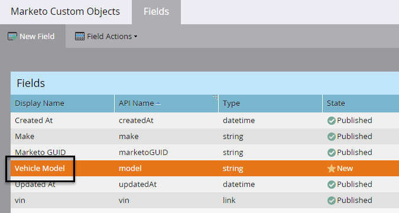

# 編輯和刪除Marketo自訂物件欄位 {#edit-and-delete-marketo-custom-object-fields}

## 編輯欄位 {#edit-a-field}

有時您需要編輯尚未核准的欄位。

1. 按一下自訂物件和您要編輯的欄位。

   

1. 在欄位標籤上，按一下 **欄位動作** 和 **編輯欄位**.

   

1. 進行變更，然後按一下 **儲存**.

   

   >[!NOTE]
   >
   >您無法編輯API名稱。

1. 變更會顯示在「欄位」清單中。

   

## 刪除欄位 {#delete-a-field}

當您不再需要自訂物件中的欄位時，可以將其刪除。

1. 在欄位標籤上，按一下 **欄位動作** 和 **刪除欄位**.

   

   提取觸發器之前，請確定您確實要刪除欄位！ 按一下 **刪除**.

   

   沒了！

   

   >[!NOTE]
   >
   >[新增Marketo自訂物件欄位](/help/marketo/product-docs/administration/marketo-custom-objects/add-marketo-custom-object-fields.md)
