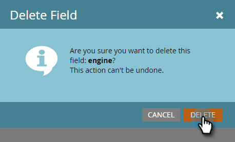

# 編輯和刪除Marketo自訂物件欄位 {#edit-and-delete-marketo-custom-object-fields}

## 編輯欄位 {#edit-a-field}

有時您需要編輯尚未核准的欄位。

1. 按一下自訂物件和您要編輯的欄位。

   

1. 在 [!UICONTROL 欄位] 標籤，按一下 **[!UICONTROL 欄位動作]** 和 **[!UICONTROL 編輯欄位]**.

   

1. 進行變更並按一下 **[!UICONTROL 儲存]**.

   

   >[!NOTE]
   >
   >您無法編輯API名稱。

1. 變更會顯示在「欄位」清單中。

   

## 刪除欄位 {#delete-a-field}

當您不再需要自訂物件中的欄位時，可以將其刪除。

1. 在欄位索引標籤中，按一下 **[!UICONTROL 欄位動作]** 和 **[!UICONTROL 刪除欄位]**.

   

1. 在提取觸發程式之前，請確定您確定要刪除欄位！ 按一下 **[!UICONTROL 刪除]**.

   

它不見了！

>[!NOTE]
>
>[新增Marketo自訂物件欄位](/help/marketo/product-docs/administration/marketo-custom-objects/add-marketo-custom-object-fields.md)
