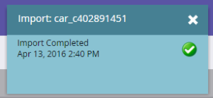

# 匯入自訂物件資料 {#import-custom-object-data}

請依照下列步驟，將自訂物件資料匯入資料庫。 若您正在使用公司自訂物件，請參閱[使用公司自訂物件](/help/marketo/product-docs/administration/marketo-custom-objects/understanding-marketo-custom-objects.md#using-custom-objects-with-companies)以取得詳細資訊。

1. 在「我的Marketo」中，移至&#x200B;**[!UICONTROL Database]**。

   

1. 按一下&#x200B;**[!UICONTROL New]**&#x200B;並選取&#x200B;**[!UICONTROL Import Custom Object Data]**。

   

1. 按一下&#x200B;**[!UICONTROL Browse]**&#x200B;以尋找資料檔。 選取檔案格式（在此範例中為逗號分隔值）。

   

1. 選取您的[!UICONTROL custom object]。

   

1. 從下拉式清單中選取[!UICONTROL Dedupe Mode]。 按一下「**[!UICONTROL Next]**」。

   

   >[!NOTE]
   >
   >當您建立或更新自訂物件記錄時，請使用一或多個重複資料刪除欄位做為唯一識別碼。 此範例使用&#x200B;**car**&#x200B;自訂物件 — vin （車輛識別碼）的重複資料刪除欄位。 如果您只更新自訂物件記錄，則可以選取[!UICONTROL Marketo Guid]作為[!UICONTROL Dedupe Mode]。

1. 將每一欄對應至Marketo欄位，從下拉式清單中選取它。

   

   >[!NOTE]
   >
   >確保檔案中的值與您比對的欄位型別相符（例如文字、整數等），否則檔案將被拒絕。

1. 按一下「**[!UICONTROL Next]**」。

   

1. 按一下「**[!UICONTROL Import]**」。

   

   >[!NOTE]
   >
   >自訂物件的大小限製為100MB。

   >[!TIP]
   >
   >在「**[!UICONTROL Send Alert To]**」欄位中輸入您的電子郵件地址，Marketo將在匯入完成時以電子郵件通知您。

1. 在熒幕右上角，您會在匯入執行時看到通知，並在匯入完成時看到最終結果。

   

>[!MORELIKETHIS]
>
>[瞭解Marketo自訂物件](/help/marketo/product-docs/administration/marketo-custom-objects/understanding-marketo-custom-objects.md)
