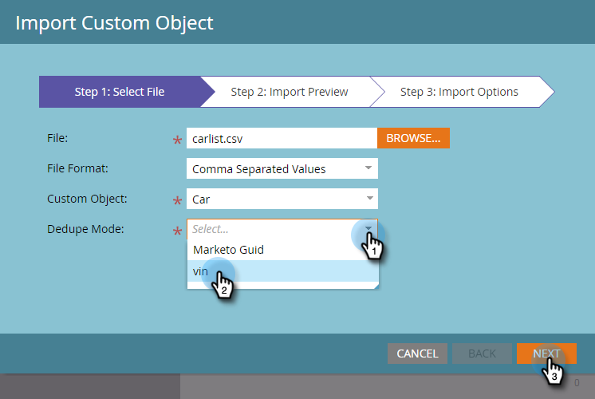

# 匯入自訂物件資料 {#import-custom-object-data}

將自訂物件資料匯入資料庫很容易。 如果您對公司使用自訂物件，請參閱 [搭配公司使用自訂物件](/help/marketo/product-docs/administration/marketo-custom-objects/understanding-marketo-custom-objects.md#using-custom-objects-with-companies) 以取得詳細資訊。

1. 在「我的Marketo」中，前往 **[!UICONTROL 資料庫]**.

   

1. 按一下 **[!UICONTROL 新增]** 並選取 **[!UICONTROL 匯入自訂物件資料]**.

   

1. 按一下 **[!UICONTROL 瀏覽]** 以找出資料檔案。 選取檔案格式（在此範例中為逗號分隔值）。

   

1. 選取您的 [!UICONTROL 自訂物件].

   

1. 選取 [!UICONTROL 重複資料刪除模式] 下拉式清單。 按一下 **[!UICONTROL 下一個]**.

   

   >[!NOTE]
   >
   >建立或更新自訂物件記錄時，請使用重複資料刪除欄位做為唯一識別碼。 此範例使用「 」的「 」重複資料刪除欄位 **car** 自訂物件 — vin （車輛識別碼）。 如果您只更新自訂物件記錄，可以選取 [!UICONTROL Marketo Guid] 作為 [!UICONTROL 重複資料刪除模式].

1. 將每個欄對應至Marketo欄位，從下拉式清單中選取它。

   

   >[!NOTE]
   >
   >請確定檔案中的值符合您要與其相符的欄位型別（例如，文字、整數等），否則檔案將被拒絕。

1. 按一下 **[!UICONTROL 下一個]**.

   

1. 按一下 **[!UICONTROL 匯入]**.

   

   >[!NOTE]
   >
   >自訂物件的大小限製為100MB。

   >[!TIP]
   >
   >在「 」中輸入您的電子郵件地址 **[!UICONTROL 傳送警報至]** 欄位和Marketo會在匯入完成後以電子郵件傳送給您！

1. 在熒幕右上角，您會在匯入執行時看到通知，並在匯入完成時看到最終結果。

   

   耶！

>[!MORELIKETHIS]
>
>[瞭解Marketo自訂物件](/help/marketo/product-docs/administration/marketo-custom-objects/understanding-marketo-custom-objects.md)
