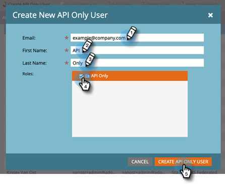

# 新增 Adobe IMS 啟用訂閱的僅 API 使用者 {#add-api-only-user-for-adobe-ims-enabled-subscriptions}

雖然Marketo Engage行銷使用者和管理員是在Adobe Admin Console中進行管理，但必須在Marketo Engage中建立和管理「僅限Marketo Engage API使用者」。

以下步驟說明如何在Marketo Engage中新增「僅限API使用者」 。 在執行此操作之前，您必須先建立[僅API角色](/help/marketo/product-docs/administration/users-and-roles/create-an-api-only-user-role.md)。

1. 在Marketo中，按一下&#x200B;**[!UICONTROL Admin]**&#x200B;並選取&#x200B;**[!UICONTROL Users & Roles]**。

   

1. 按一下「**[!UICONTROL Create API Only User]**」。

   

1. 輸入[!UICONTROL Email]、[!UICONTROL First Name]和[!UICONTROL Last Name]給僅限API的使用者。 選取您要指派給使用者的[!UICONTROL API Only]角色。 完成後請按一下 **[!UICONTROL Create API Only User]**。

   

>[!NOTE]
>
>當動作成功時，僅API使用者建立強制回應視窗將關閉，使用者清單將重新整理，並將顯示新使用者。
