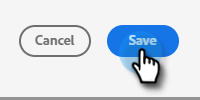
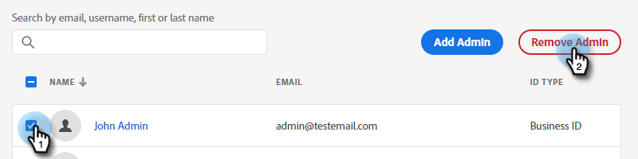

# 新增或移除產品管理員 {#add-or-remove-a-product-admin}

>[!NOTE]
>
>**系統** 管理員僅在Adobe組織層級建立。 如果您認為您需要多個專案，請聯絡 [Marketo支援](https://nation.marketo.com/t5/support/ct-p/Support).

## 新增產品管理員 {#add-a-product-admin}

>[!IMPORTANT]
>
>必須將管理員新增到產品設定檔才能存取Marketo Engage。

1. 登入 [Adobe Admin Console](https://adminconsole.adobe.com/){target="_blank"}.

   

1. 按一下 **Marketo Engage**.

   

1. 選取所需的訂閱（如果有多個訂閱）。

   

1. 按一下 **[!UICONTROL 管理員]** 標籤。

   

1. 按一下 **[!UICONTROL 新增管理員]** 按鈕。

   

1. 輸入您要新增之管理員的電子郵件地址或使用者名稱。 名字和姓氏為選用。 按一下 **[!UICONTROL 儲存]**.

   

1. 按一下您剛新增的管理員名稱。

   

1. 在「產品」底下，按一下三點選單並選取 **[!UICONTROL 編輯]**.

   

1. 按一下 **+** 簽署。 按一下所需Marketo Engage訂閱（如果有多個訂閱）旁的>形箭號，然後選取所需的產品設定檔。

   

1. 按一下 **[!UICONTROL 儲存]**.

   

之後，使用者會收到兩封電子郵件。 第一封電子郵件會通知他們，他們已獲得Marketo Engage的產品管理員許可權。 第二封電子郵件會邀請他們登入Marketo Engage。

>[!NOTE]
>
>透過Adobe Admin Console將產品管理員使用者新增至Marketo Engage時，使用者可在訂閱內獲得Adobe產品管理員角色。

## 移除管理員 {#remove-a-user}

1. 登入 [Adobe Admin Console](https://adminconsole.adobe.com/){target="_blank"}.

   

1. 按一下 **Marketo Engage**.

   

1. 選取所需的訂閱（如果有多個訂閱）。

   

1. 按一下 **[!UICONTROL 管理員]** 標籤。

   

1. 選取您要移除的管理員，然後按一下 **[!UICONTROL 移除管理員]** 按鈕。

   

1. 按一下 **[!UICONTROL 移除管理員]** 以確認。

   

接著，使用者會收到電子郵件，通知他們不再擁有Marketo Engage的產品管理員存取權。
