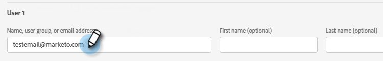
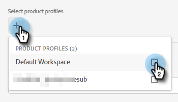
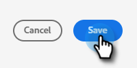

# 新增或移除使用者 {#add-or-remove-a-user}

## 新增使用者 {#add-a-user}

1. 登入 [Adobe Admin Console](https://adminconsole.adobe.com/).

   

1. 按一下 **Marketo Engage**.

   

1. 選取所需的訂閱（如果您有多個訂閱）。

   

1. 按一下 **使用者** 標籤。

   

1. 按一下 **添加用戶** 按鈕。

   

1. 輸入要添加的用戶的名稱、用戶組或電子郵件地址。 名字和姓氏為選用。

   

1. 按一下 **+** 圖示並選取所需的產品設定檔。

   

   >[!IMPORTANT]
   >
   >使用者 **必須** 新增至產品設定檔，以存取Marketo Engage。

1. 按一下 **儲存**.

   

然後，使用者會收到電子郵件以登入Marketo Engage。

>[!NOTE]
>
>透過Adobe Admin Console將使用者新增至Marketo Engage時，訂閱的「預設」工作區會授予該使用者「標準使用者」角色。 如果需要調整使用者在工作區中的角色，這是在Marketo Engage中完成， [如下所述](/help/marketo/product-docs/administration/users-and-roles/managing-user-roles-and-permissions.md).

## 移除使用者 {#remove-a-user}

1. 登入 [Adobe Admin Console](https://adminconsole.adobe.com/).

   

1. 按一下 **Marketo Engage**.

   

1. 選取所需的訂閱（如果您有多個訂閱）。

   

1. 按一下 **使用者** 標籤。

   

1. 選取您要移除的使用者，然後按一下 **移除** 按鈕。

   

1. 按一下 **刪除用戶** 確認。

   

然後，使用者會收到電子郵件，通知他們已無法存取Marketo Engage。

>[!MORELIKETHIS]
>
>* [Adobe Admin Console使用者](https://helpx.adobe.com/enterprise/using/users.html)
>* [個別管理使用者](https://helpx.adobe.com/enterprise/using/manage-users-individually.html)

