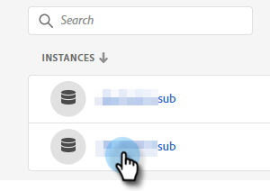

# 添加或刪除用戶 {#add-or-remove-a-user}

## 添加用戶 {#add-a-user}

1. 登錄到 [Adobe Admin Console](https://adminconsole.adobe.com/)。

   

1. 按一下 **Marketo Engage**。

   

1. 選擇所需的訂閱（如果您有多個訂閱）。

   

1. 按一下 **用戶** 頁籤。

   

1. 按一下 **添加用戶** 按鈕

   

1. 輸入要添加的用戶的名稱、用戶組或電子郵件地址。 名字和姓氏是可選的。

   

1. 按一下 **+** 表徵圖，然後選擇所需的產品配置檔案。

   

   >[!IMPORTANT]
   >
   >用戶 **必須** 添加到產品配置檔案以訪問Marketo Engage。

1. 按一下 **保存**。

   

然後，用戶將收到一封電子郵件以登錄Marketo Engage。

>[!NOTE]
>
>當用戶通過Adobe Admin Console添加到Marketo Engage中時，將在訂閱的「預設」工作區中授予他們「標準用戶」角色。 如果需要調整用戶在工作區中的角色，則在Marketo Engage中完成， [此處描述](/help/marketo/product-docs/administration/users-and-roles/managing-user-roles-and-permissions.md)。

## 刪除用戶 {#remove-a-user}

1. 登錄到 [Adobe Admin Console](https://adminconsole.adobe.com/)。

   

1. 按一下 **Marketo Engage**。

   

1. 選擇所需的訂閱（如果您有多個訂閱）。

   

1. 按一下 **用戶** 頁籤。

   

1. 選擇要刪除的用戶，然後按一下 **刪除** 按鈕

   

1. 按一下 **刪除用戶** 確認。

   

然後，用戶將收到一封電子郵件，通知他們不再具有訪問Marketo Engage的權限。

>[!MORELIKETHIS]
>
>* [Adobe Admin Console用戶](https://helpx.adobe.com/enterprise/using/users.html)
>* [單獨管理用戶](https://helpx.adobe.com/enterprise/using/manage-users-individually.html)

