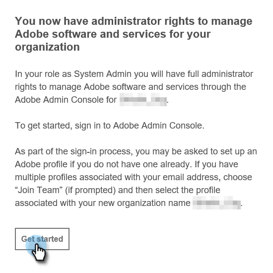

# 管理設定 {#admin-setup}

將您添加為Adobe系統管理員，以在Adobe組織中Marketo Engage後，您需要執行一些步驟來完成初始設定。

## 系統管理設定 {#system-admin-setup}

1. 將您添加為指定的系統管理員以進行Marketo Engage（在新組織或已建立的組織中）後，您將收到一封歡迎電子郵件。 在該電子郵件中，按一下 **開始**。

   

1. 如果您以前曾訪問過Adobe ID的應用程式，您將被直接帶到Adobe Admin Console。 如果沒有， [設定你的Adobe ID](https://helpx.adobe.com/manage-account/using/create-update-adobe-id.html)。

   

## 建立產品配置檔案 {#create-a-product-profile}

系統管理員訪問Admin Console後，該建立產品配置檔案了。 這就是您的用戶/管理員訪問Marketo Engage的方式。

1. 在「概述」頁的「產品和服務」下，按一下 **Marketo Engage**。

   

1. 選擇所需的訂閱。 如果您只有一個，請跳至下一步。

   

   >[!NOTE]
   >
   >如果您確實有多個訂閱，則必須對每個訂閱都執行這些步驟。

1. 按一下 **新建配置檔案** 按鈕

   

1. 為產品配置檔案指定名稱（顯示名稱和說明是可選的），然後按一下 **保存**。

   

>[!NOTE]
>
>如果您設定了多個產品配置檔案，則用戶對Marketo的訪問權限將相同，而不管他們添加到哪個配置檔案。

>[!MORELIKETHIS]
>
>[添加或刪除產品管理員](/help/marketo/product-docs/administration/marketo-with-adobe-identity/add-or-remove-a-product-admin.md)
