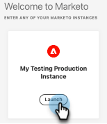

# AdobeIdentity Management常見問題集 {#adobe-identity-management-faq}

**什麼是Adobe識別？**

AdobeIdentity Management系統包含三個元件。

* [!DNL Adobe Identity Service]：處理一般使用者的驗證和驗證，包括同盟和執行階段單一登入(SSO)。

* Adobe Admin Console：此Admin Console提供一個中央位置，用於管理整個組織的Adobe權益。 它會處理使用者管理、雲端服務、案頭授權權益、同盟設定，並提供資料遺失預防安全性功能。

* Adobe使用者管理API (UMAPI)：可讓組織在Adobe Admin Console中透過API層級管理企業使用者和權益。

**現有的Marketo Engage訂閱何時會與IMS整合？**

現有的Marketo Engage訂閱目前正在任何銷售活動上移轉至Adobe IMS，包括續約、重新合約活動及/或增補專案。 自2024年10月起，支援銷售活動以外的移轉。

**移轉之後，Marketo EngageURL是否會維持不變？**

不可以。 移轉後URL看起來會不同。

**我們需要做任何事來準備URL變更嗎？**

可以。移轉後，Marketo Engage會從experience.adobe.com傳送至Adobe Experience Cloud。 您必須與您的IT團隊合作，允許列出本文](/help/marketo/getting-started/initial-setup/configure-protocols-for-marketo.md){target="_blank"}頂端所列[的所有Adobe網域，以防止Marketo Engage存取中斷。

先前在engage-xx.marketo.com網域&#x200B;_上Marketo Engage資產的連結和書籤將_&#x200B;繼續運作。 不過，您必須先登入您要導覽至的URL的Marketo Engage例項。 例如，若要導覽至Munchkin ID為123-ABC-456之執行個體中Smart Campaign的書籤，您必須先以Munchkin ID 123-ABC-456登入Marketo Engage執行個體。

**這是否適用於SSO？**

可以。與Adobe IMS的整合可支援通用ID使用者和SSO。 SSO現在由Adobe IMS驅動，並在Adobe Admin Console中的組織層級設定。 不過，與Marketo EngageSP啟動的支援相比，AdobeIdP啟動的支援有所不同（[在這裡瞭解更多](https://helpx.adobe.com/tw/enterprise/using/set-up-identity.html){target="_blank"}）。 若您在移轉至Admin Console後需要有關SSO差異的協助，請聯絡[Adobe客戶服務](https://helpx.adobe.com/contact.html){target="_blank"}。

**Adobe產品管理員和Marketo Engage管理員之間有何差異？**

* Adobe產品管理員是Marketo平台的新角色。
* Adobe產品管理員角色已授與在Adobe Admin Console中新增為產品管理員的使用者
* Adobe產品管理員是唯讀角色，無法編輯或從Marketo Engage刪除。
* Adobe產品管理員具有與標準Marketo管理員相同的許可權和許可權。
* Marketo Engage管理員的角色仍然是管理員，並授予使用者Marketo Engage。

**使用者管理API使用者端支援是否有任何變更？**

可以。已上線Adobe IMS的使用者無法使用所有現有的Marketo使用者管理API。 若是使用者邀請、更新及刪除動作，應使用Adobe[IMS API](https://www.adobe.io/apis/experienceplatform/umapi-new.html){target="_blank"}。 若是角色管理，仍會套用Marketo User Management API。 除此之外，Marketo REST API使用者端支援沒有其他變更。

**如果我們已與IMS整合，該和誰聯絡以尋求支援？**

* 使用者前移轉： [行銷國家社群](https://nation.marketo.com/t5/support/ct-p/Support)或電子郵件`customercare@marketo.com`中的檔案支援案例。

* 使用者後移轉： [行銷國家社群](https://nation.marketo.com/t5/support/ct-p/Support)或電子郵件`customercare@marketo.com`中的檔案支援案例。

* 支援後遷移完成：產品支援管理員可以透過Experience League支援入口網站提出案例。

如果您有Ultimate Success，便能存取Admin Console移轉白手套服務。 請聯絡Adobe客戶團隊（您的客戶經理）以尋求協助。

**如果我使用Adobe識別來存取其他Adobe應用程式，可以使用該識別來存取Marketo嗎？**

即使您有其他Adobe產品，在訂閱移轉至IMS之前，您無法使用Adobe身分存取Marketo。

**Marketo的使用者角色（位於工作區內）是否在Adobe Admin Console中進行管理？**

不可以。 使用者角色管理（在工作區中）在Marketo Engage中完成。

**我是IMS整合式訂閱的Marketo管理員，無法存取Admin Console。 如何取得存取權？**

任何可存取貴組織Admin Console的Adobe系統或產品管理員都可以為您提供存取權。 如果您不確定組織中的哪些人擁有主控台中的管理員許可權，請聯絡[Adobe客戶服務](https://helpx.adobe.com/contact.html){target="_blank"}。

**管理員如何將使用者新增至Marketo [!DNL Sales Connect]？**

雖然[!DNL Sales Connect]的Admin Console中會有產品卡，但不應使用Admin Console來新增/管理使用者。 下列連結可讓管理員透過Marketo [!DNL Sales Connect]管理使用者： [https://toutapp.com/next#settings/admin/user-management](https://toutapp.com/next#settings/admin/user-management){target="_blank"}。

**我可以在何處進一步瞭解Adobe Admin Console？**

[https://helpx.adobe.com/enterprise/admin-guide.html](https://helpx.adobe.com/tw/enterprise/admin-guide.html){target="_blank"}。

**我是否仍要移至Marketo的「管理員」區段，為我的帳戶變更使用者帳戶？**

否，您必須導覽至[account.adobe.com](https://account.adobe.com){target="_blank"}。

**這如何與Marketo的通用ID搭配運作？**

已上線Adobe身分的訪客可透過產品中的訂閱切換器，順暢存取所有啟用IMS的訂閱。

**這是否適用於SSO？**

可以。Marketo與Adobe IMS的整合可支援通用ID使用者和SSO。 SSO現在由Adobe IMS驅動，並在Adobe Admin Console中的組織層級設定。 [在這裡瞭解更多](https://helpx.adobe.com/tw/enterprise/using/set-up-identity.html){target="_blank"}。

**我已加入Adobe身分識別，現在我要實作SSO。 我該做什麼？**

如果您想要實作單一登入，且您的訂閱已上線到Adobe身分識別，而沒有Adobe組織中實作的SSO，請提交票證至[Marketo支援](https://nation.marketo.com/){target="_blank"}，並將主題指定為「Admin Console上的Marketo，實作SSO」。

**裝置授權如何運作？**

Adobe IMS目前不支援Marketo的裝置授權功能之類的功能。

**還是可以使用[在邀請使用者對話方塊中登入]功能，讓使用者的登入在其電子郵件中是唯一的？**

不可以。 訂閱啟用IMS時，使用者邀請工作流程不再有效，因此功能不再有效。 Adobe身分需要使用者的身分由其電子郵件驅動。

**若為Adobe IMS，我們是否可選擇使用Adobe ID、Enterprise ID或Federated ID？**

可以，您可以決定要獲得組織支援的身分型別。 更多資訊可在下列位置找到： [身分總覽](https://helpx.adobe.com/tw/enterprise/using/identity.html)和此處： [設定身分](https://helpx.adobe.com/tw/enterprise/using/set-up-identity.html){target="_blank"}。

**Adobe Admin Console支援哪些產品卡？**

支援的產品卡包括：Marketo Engage、Marketo Measure、Marketo Dynamic Chat、Marketo Sales Connect和Marketo Sales Insight Actions。

**如果我移轉至Adobe識別時，使用者登入與電子郵件不符，該怎麼辦？**

目前的Marketo Engage使用者若是登入與電子郵件地址不同，在移轉至Adobe身分識別後，將不再使用該認證登入。 Adobe身分一律使用使用者的電子郵件地址進行驗證。 您可以在[account.adobe.com](https://account.adobe.com){target="_blank"}更新Adobe身分識別電子郵件地址。

**如果我的訂閱使用IP限制設定，則Adobe識別移轉後會發生什麼事？**

當訂閱上線至Adobe身分時，IP限制設定不會移轉至Adobe Admin Console。 Marketo的IP限制設定包括僅允許從特定IP位址存取，以及封鎖特定IP位址的存取。 目前，Adobe Identity Management系統不支援IP限制功能。

Adobe Identity Management System將於2025年初推出一項功能，僅支援允許特定IP位址，並支援目前使用此功能的Marketo使用者的轉換。 目前使用此功能的使用者在功能發行前不會進行使用者移轉。 交付功能後，使用者將會收到排程其移轉的通知。 我們會在有需要時提供有關功能的詳細資訊。

目前使用IP限制以封鎖特定位址存取的使用者，在移轉至Adobe身分識別後將無法再使用此功能，因為AdobeIdentity Management系統不支援此功能。

**如果我的使用者具有「略過單一登入」選項，則Adobe身分移轉後會發生什麼事？**

當訂閱上架到Adobe身分時，單一登入(SSO)是在Adobe組織層級為所有使用者設定。 設定SSO時，將會對該Adobe組織中的所有Marketo使用者/所有Marketo執行個體強制執行。之前，Marketo支援將使用者角色設定為可選用「略過單一登入」。 Adobe Identity Management系統不支援此功能。

**我有多個訂閱，但並非所有訂閱都啟用單一登入。 Adobe身分移轉之後會發生什麼事？**

當訂閱上架到Adobe身分時，單一登入(SSO)會在Adobe組織層級設定。 這表示SSO適用於Adobe組織中的所有產品執行個體。SSO設定後，將套用至該Adobe組織中的所有Marketo執行個體。之前，Marketo在執行個體層級支援此設定。 Adobe Identity Management系統不支援此功能。

**在Adobe身分移轉後，我們目前用於Marketo Engage的CNAME、SPF或DKIM是否需要任何變更？**

否，這些設定不受影響。

**如何防止工作階段逾時？**

在[進階設定](https://helpx.adobe.com/enterprise/using/authentication-settings.html#advanced-settings){target="_blank"}中，您可以自訂想要的最長工作階段存留期（需要系統管理員許可權）。 建議在產品移轉後、使用者移轉前建立此設定。

**我現在必須瀏覽到Experience Cloud才能存取Marketo Engage。 有辦法簡化此流程嗎？**

可以。您可以在按一下Marketo Engage執行個體進入頁面上的&#x200B;**啟動**&#x200B;按鈕後，建立啟動連結的瀏覽器書籤，以略過該頁面。

