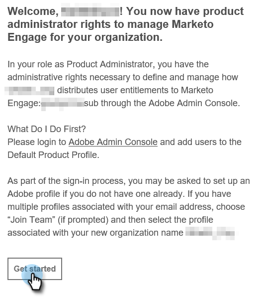

# 產品管理員設定 {#product-admin-setup}

1. 系統管理員邀請您之後，您將會收到歡迎電子郵件。 在該電子郵件中，按一下&#x200B;**[!UICONTROL Get Started]**。

   

1. 如果您先前曾透過Adobe ID存取應用程式，您將會直接進入Adobe Admin Console。 如果沒有，[請設定您的Adobe ID](https://helpx.adobe.com/tw/manage-account/using/create-update-adobe-id.html){target="_blank"}。

   

就是這麼簡單！ 產品管理員主要負責新增使用者。 [在這裡瞭解如何這樣做](/help/marketo/product-docs/administration/marketo-with-adobe-identity/add-or-remove-a-user.md#add-a-user){target="_blank"}。
