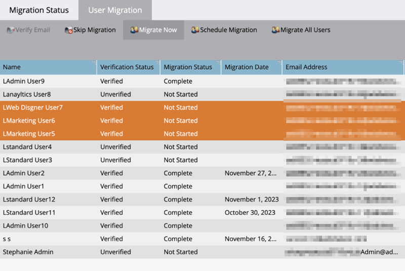

# 移轉至Adobe身分 {#migrating-to-adobe-identity}

當Adobe排程訂閱的使用者移轉時，Marketo Engage產品管理員將可存取移轉主控台，這可在整合底下「管理」區域的導覽功能表中找到。

## 移轉前 {#pre-migration}

在開始移轉之前，管理員可以透過瀏覽至Migration Console中的移轉前畫面來修改訂閱的使用者移轉開始日期。 若要變更日期，管理員可以按一下&#x200B;**編輯**&#x200B;按鈕。

管理員可選擇未來8到30天的日期。 選取日期時，管理員必須按一下[儲存] **才能進行變更。**

>[!NOTE]
>
>若要在8天前或超過30天後要求日期，或如果您需要在移轉前主控台鎖定後調整日期，請傳送電子郵件至`marketocares@marketo.com`。

## 移轉至Adobe識別 {#migrations-to-adobe-identity}

所有採用美國時區的Marketo訂閱將會從使用者移轉開始日期的太平洋標準時間午夜開始。 所有其他訂閱的使用者移轉將於訂閱指定時區的午夜開始。 訂閱的使用者移轉開始時，Marketo管理區域將不再提供使用者管理，僅能在Adobe Admin Console中完成。 角色管理仍保留在Marketo管理區域的使用者和角色標籤中，以及本機（僅限API）使用者管理中。

Adobe會先使用已驗證的電子郵件自動移轉所有Marketo管理員。 Marketo管理員移轉至Adobe身分識別後，系統會將他們新增至訂閱的Adobe Admin Console，作為Marketo訂閱的產品管理員，並在Marketo應用程式中將Adobe產品管理員角色（連同他們先前曾擁有的任何其他角色）指派給訂閱者，並賦予其Adobe ID許可權。 管理員會收到兩封電子郵件。 一個表示被指派為Adobe產品管理員，另一個表示其Adobe ID有權使用Marketo產品。

>[!IMPORTANT]
>
>您必須按一下軟體權利檔案電子郵件中的&#x200B;**接受邀請**&#x200B;按鈕，才能存取Adobe ID的Marketo Engage。

**Marketo產品管理員電子郵件**

**Marketo權益電子郵件**

**如果您的Marketo訂閱使用者少於75名，且在Marketo和/或Adobe組織**&#x200B;中沒有SSO，Adobe會自動移轉其餘的使用者。 此工作流程旨在提供最高層級的自動化，而執行移轉不需要任何動作。 移轉完成後，Marketo移轉主控台將不再出現在Marketo管理導覽區域中，所有使用者都將使用Adobe ID存取Marketo。

**如果您的Marketo訂閱有75位以上的使用者，或在Marketo和/或Adobe組織**&#x200B;中具有SSO，Marketo產品管理員將在使用者移轉開始時，獲得移轉主控台的「自助使用者移轉」工具的存取權，並在登入「我的Marketo」頁面時，透過橫幅收到警報。 管理員將負責使用自助使用者移轉工具完成使用者移轉。

## Marketo自助使用者移轉 {#marketo-self-service-user-migration}

Marketo自助使用者移轉控制檯工具包含兩個標籤。

* **移轉狀態標籤**
* **使用者移轉索引標籤**

完成自助服務移轉需要執行3個主要步驟。

1. 移轉所有需要的合格電子郵件地址驗證使用者（[使用者移轉]索引標籤）
1. 略過所有不符合資格的使用者及任何不符合資格的使用者（使用者移轉標籤）
1. 完成步驟1和2後，完成移轉確認（「移轉狀態」標籤）

### 移轉狀態標籤 {#migration-status-tab}

「移轉狀態」標籤提供有關使用者電子郵件驗證先決條件、使用者移轉和啟用，以及完成訂閱移轉的整體進度。

移轉狀態頂端會顯示訂閱移轉到期日和延長到期日的按鈕。 您可以在[使用者移轉到期區段](#user-migration-expiration)中找到移轉到期的詳細資訊。

在「移轉狀態」標籤的下一區段中，有兩個進度列。 第一個進度列是顯示使用者電子郵件驗證完成的進度。 第二個進度列是顯示使用者移轉完成的進度。

接著，會向管理員顯示「狀態」的三個區段。

* **使用者電子郵件驗證**：訂閱內使用者的驗證狀態。
* **使用者移轉與啟用**：訂閱內使用者的使用者移轉與啟用(移轉與Marketo Engage產品的權益)狀態。
* **移轉確認**：訂閱的移轉完成狀態。

#### 使用者電子郵件驗證 {#user-email-verification}

在「使用者電子郵件驗證」區段中，管理員可以在移轉至「Adobe身分」之前，為訂閱中的使用者找到電子郵件驗證的目前狀態。

管理員可以檢視訂閱的電子郵件驗證狀態、訂閱中完成電子郵件驗證的使用者百分比，以及已標籤為略過的使用者人數。 系統會報告訂閱中所有使用者電子郵件驗證狀態的狀態。 管理員可以按一下略過的使用者數目，並會導覽至「使用者移轉」索引標籤以檢視略過的使用者。

管理員可在「移轉控制檯」的「使用者移轉」標籤及「Marketo管理員」區域的「使用者與角色」標籤中，或透過使用者的「帳戶設定」重新傳送驗證電子郵件。 就像使用者邀請電子郵件一樣，驗證電子郵件中的連結將在3天後過期。 如需電子郵件驗證的詳細資訊，請參閱[社群](https://nation.marketo.com/)和[電子郵件驗證檔案](/help/marketo/product-docs/administration/users-and-roles/email-verification.md)。

>[!IMPORTANT]
>
>如果Marketo Engage使用者未驗證其電子郵件地址，則無法將他們移轉至Adobe ID，並在移轉完成後將無法存取Marketo訂閱。 若要重新取得存取權，Marketo產品管理員需要將使用者新增為新使用者。

#### 使用者移轉與啟用 {#user-migration-and-activation}

在「使用者移轉和啟動」區段中，管理員可以找到目前使用者移轉總數的狀態，以及AdobeIdentity Management系統的權益。

管理員可檢視其訂閱中移轉至Adobe ID或標籤為已略過的使用者百分比。 所有使用者在訂閱中的移轉至Adobe ID狀態時會報告狀態，或標籤為已略過且不會移轉。 當使用者已移轉並有權使用Marketo Engage或略過時，此狀態將會更新。

#### 移轉確認 {#migration-confirmation}

在「移轉確認」區段中，管理員需確認訂閱的使用者移轉已完成。

一旦計入訂閱中的所有使用者（已移轉或略過），就會顯示「完成移轉」按鈕。

執行移轉的管理員必須按一下&#x200B;**完成移轉**&#x200B;按鈕以完成移轉確認。 系統會提示他們&#x200B;**確認**。

確認使用者移轉完成後，「移轉主控台」將會從「管理員」導覽功能表中移除。

### 使用者移轉到期日 {#user-migration-expiration}

Adobe需要客戶在30天內完成自助移轉。 如果到期日已過，系統不會封鎖管理員移轉使用者或完成移轉，但他們只能依需求移轉使用者。 如果管理員需要更多時間，可以延長訂閱的到期日。

按一下&#x200B;**延長到期日**&#x200B;按鈕後，日期將更新為一週後。 管理員最多可將到期日延長三次。

如果您未在到期日之前完成移轉，將會聯絡Adobe。

### 使用者移轉標籤 {#user-migration-tab}

「使用者移轉」索引標籤為管理員提供工具，讓管理員能夠完全控制使用者移轉。

管理員可選擇執行以下操作：

* 透過「驗證電子郵件」按鈕為未驗證的使用者觸發驗證電子郵件
* 如果管理員知道使用者可以/不會驗證其電子郵件或不應該透過「略過移轉」按鈕移轉，則略過該使用者的移轉
* 透過「立即移轉」按鈕依要求移轉所選使用者
* 透過「排程移轉」按鈕，為特定日期選定的使用者排程使用者移轉
* 透過「移轉所有使用者」按鈕，依需求移轉所有合格使用者（不需要使用者選擇）

**驗證電子郵件**

使用者若要移轉至Adobe ID，必須經過電子郵件驗證。 如果有任何使用者尚未驗證其電子郵件地址且需要移轉，管理員可以觸發驗證電子郵件，以再次傳送給使用者。 選取未經驗證的使用者後，「驗證電子郵件」按鈕將變成可點按。

當管理員按一下&#x200B;**驗證電子郵件**&#x200B;按鈕時，他們會收到電子郵件已傳送的通知。

**略過和取消略過使用者移轉**

使用者移轉期間，所有使用者都需要移轉或略過。 Adobe需要管理員確認使用者不會被移轉，而且管理員需要將使用者標籤為已略過。 如果管理員未確認，他們將無法確認使用者移轉的完成。 一旦使用者移轉完成，所有略過的使用者都將失去對Marketo的存取權。

>[!IMPORTANT]
>
>管理員必須略過具有未驗證電子郵件的所有使用者。 如果使用者已驗證其電子郵件，但管理員由於任何原因不想移轉他們，他們應將他們標籤為已略過。

若要略過使用者，管理員可以選取想要的使用者。 「略過移轉」按鈕將變成可點按。 按一下&#x200B;**略過移轉**&#x200B;按鈕後，頁面將會重新整理，且所選使用者的驗證狀態和移轉狀態將會更新為「已略過」。

如果確定需要移轉使用者，管理員可以取消略過先前略過的使用者。

若要取消略過使用者，管理員可以選取想要的使用者。 「未略過移轉」按鈕會變成可點按的狀態。 按一下&#x200B;**取消略過移轉**&#x200B;按鈕後，頁面將會重新整理。  所選使用者的驗證狀態將更新為其目前狀態（「已驗證」或「未驗證」），而使用者的移轉狀態將更新為「未開始」。

>[!NOTE]
>
>只有所有選取的使用者皆具有「已略過」移轉狀態時，「未略過移轉」按鈕才會生效。

### 將Marketo使用者移轉至AdobeID {#migrating-marketo-users-to-adobe-ids}

Marketo產品管理員將能選取要批次移轉的使用者，或一次選取所有符合資格的使用者。 選取使用者後，管理員即可選擇「立即移轉」或「排程移轉」以供稍後使用，管理員可靈活控制要移轉的使用者及移轉時間。 管理員在訂閱中也會看到「移轉所有使用者」的選項。

例如，管理員可以選取要先移轉的一組「超級使用者」。 成功完成這些使用者移轉後，他們就可以根據變數（例如工作區/企業或功能/角色）選取不同的使用者群組，以透過進一步批次使用者移轉。 或者，他們可以在第一個批次成功後，決定移轉訂閱中的其餘使用者。 目標是要提供最大的彈性來將AdobeID轉出給使用者。

所有使用者移轉同時發生，應該會在60秒內成功完成。 雖然特定使用者正在進行使用者移轉，但使用者最多可能會失去一分鐘的存取權，而且只有在使用者已登入應用程式的情況下才會發生這種情況。 完成使用者移轉後，使用者將收到一封電子郵件，說明如何使用Adobe身分登入Marketo Engage。 使用者必須先透過電子郵件&#x200B;_中的按鈕連結接受邀請，才能使用Adobe ID登入_。 如需如何使用Adobe ID [登入Marketo Engage的指示，請參閱此處](/help/marketo/product-docs/administration/marketo-with-adobe-identity/user-sign-in-with-adobe-id.md)。

使用者移轉是獨立處理，因此如果使用者移轉失敗，Adobe會繼續處理其他使用者移轉。 如果發生使用者移轉失敗，管理員不需要採取任何動作。 管理員將收到有關錯誤的電子郵件通知，並提醒Adobe正在努力立即解決問題。 如果使用者的移轉失敗且使用者已登入Marketo Engage，則當移轉重新嘗試時，使用者最多可能會失去兩分鐘的存取權。 如果使用者的移轉失敗，使用者可以繼續使用其Marketo身分存取Marketo Engage，直到收到電子郵件通知得知其移轉成功為止，並且系統會邀請他們使用Adobe ID登入。

**立即移轉**

管理員可以選取一或多個要依需求移轉的使用者。 這將會立即觸發使用者移轉。 若要移轉一或多個使用者，管理員可以選取想要的使用者，然後按一下「立即移轉」按鈕。

>[!NOTE]
>
>只有當所有選取的使用者都具有「已驗證」驗證狀態時，「立即移轉」按鈕才會生效。

按一下&#x200B;**立即移轉**&#x200B;按鈕後，系統會提示管理員確認所選使用者的移轉。 管理員確認後，使用者移轉將儘快開始處理。

**排程移轉**

管理員可以選取一個或多個使用者，以排程在稍後日期進行移轉。 若要排程一或多個使用者的移轉，管理員會選取所要的使用者，且「排程移轉」按鈕將變成可點按。

>[!NOTE]
>
>只有在所有選取的使用者具有「已驗證」的驗證狀態時，「排程移轉」按鈕才會作用。

按一下&#x200B;**排程移轉**&#x200B;按鈕後，系統會提示管理員選取所選使用者的所需移轉日期。 管理員只能選取訂閱的移轉到期日之前的日期。 當管理員確認時，使用者移轉將排程在選取的日期開始處理。

>[!NOTE]
>
>所有採用美國時區的Marketo訂閱將會從移轉開始日期的太平洋標準時間午夜開始移轉。 所有其他訂閱的使用者移轉將於訂閱指定時區的午夜開始。

**移轉所有使用者**

管理員可隨時選取移轉訂閱中所有符合資格的使用者。 這將會立即觸發合格使用者的移轉。 符合資格的使用者是有已驗證電子郵件的使用者，但尚未移轉。

按一下&#x200B;**移轉所有使用者**&#x200B;按鈕後，系統會提示管理員&#x200B;**確認所有合格使用者的**&#x200B;移轉。 管理員確認後，使用者移轉將儘快開始處理。

