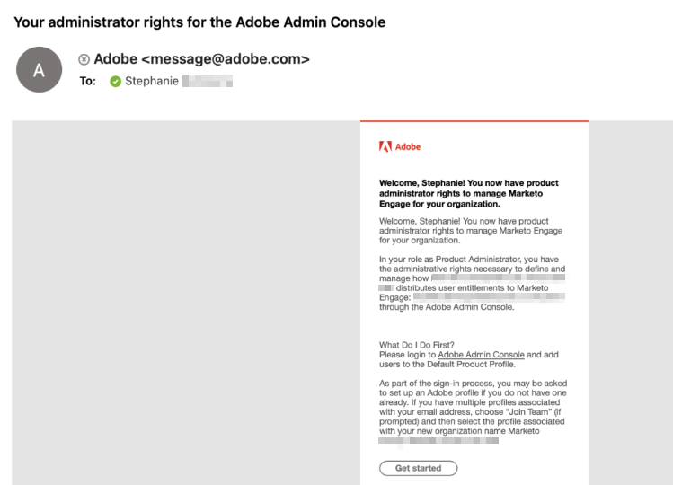
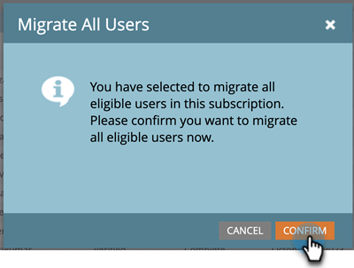

# 遷移至 Adobe Identity {#migrating-to-adobe-identity}

當 Adobe 排程訂閱的使用者遷移時，Marketo Engage 產品管理員可存取「遷移主控台」，您可在整合下方「管理區域」的導覽選單中找到。

## 遷移前 {#pre-migration}

在開始遷移之前，管理員可瀏覽至「遷移主控台」的「遷移前」畫面，以修改訂閱的使用者遷移開始日期。若要變更日期，管理員可以按一下&#x200B;**編輯**&#x200B;按鈕。

管理員可選擇未來 8 到 30 天之間的日期。選取日期後，管理員必須按一下&#x200B;**儲存**，才能完全變更。

>[!NOTE]
>
>若要求的日期為 8 天之前或 30 天以後，或如果您在遷移前主控台鎖定後需要調整日期，請傳送電子郵件至 `marketocares@marketo.com`。

## 遷移至 Adobe Identity {#migrations-to-adobe-identity}

所有採用美國時區的 Marketo 訂閱都將於使用者遷移開始日期的太平洋標準時間午夜開始進行遷移。所有其他訂閱的使用者遷移將於訂閱指定時區的午夜開始。訂閱的使用者遷移開始後，在 Marketo 管理區域中即無法再進行使用者管理，而僅能在 Adobe Admin Console 中進行。角色管理則仍保留在 Marketo 管理區域的「使用者與角色」索引標籤中，本機 (僅限 API) 使用者管理也是。

Adobe 會先使用已驗證的電子郵件自動遷移所有 Marketo 管理員 (具有標準管理員角色)。Marketo 管理員遷移至 Adobe Identity 後，即會新增至訂閱的 Adobe Admin Console，作為 Marketo 訂閱的產品管理員，並獲指派 Marketo 應用程式中的 Adobe 產品管理員角色 (連同其先前已擁有的任何其他角色)，其 Adobe ID 也有權使用訂閱。管理員會收到兩封電子郵件。一封示已獲指派為 Admin Console 產品管理員，另一封則表示其 Adobe ID 有權使用 Marketo 產品。

>[!IMPORTANT]
>
>您必須按一下權益電子郵件中的&#x200B;**接受邀請**&#x200B;按鈕，才能使用 Adobe ID 來存取 Marketo Engage。

**Marketo 產品管理員電子郵件**

**Marketo 權益電子郵件**

**如果您的 Marketo 訂閱在 Marketo 和/或 Adobe 組織**&#x200B;中都未使用 SSO，Adobe 會自動遷移您其餘的使用者。此工作流程旨在提供最高層級的自動化，而且不需要採取任何動作即可執行遷移。遷移完成後，Marketo 遷移主控台即不會再出現在 Marketo 管理導覽區域中，所有使用者都將使用 Adobe ID 來存取 Marketo。

**如果您的 Marketo 訂閱在 Marketo 和/或 Adobe 組織**&#x200B;中使用 SSO，Marketo 管理員在使用者遷移開始時，即可存取遷移主控台的「自助使用者遷移」工具，並在登入「我的 Marketo」頁面時，透過橫幅收到警示。管理員會負責使用自助使用者遷移工具來完成使用者遷移。

## Marketo 自助使用者遷移 {#marketo-self-service-user-migration}

Marketo 自助使用者遷移主控台工具包含兩個索引標籤。

* **遷移狀態索引標籤**
* **使用者遷移索引標籤**

完成自助服務遷移需要進行 3 個主要步驟。

1. 遷移所有符合資格且電子郵件地址已驗證的所需使用者 (使用者遷移索引標籤)
1. 略過所有不符合資格的使用者及任何符合資格但不需要的使用者 (使用者遷移索引標籤)
1. 完成步驟 1 和 2 後，完成遷移確認 (遷移狀態索引標籤)

### 遷移狀態索引標籤 {#migration-status-tab}

遷移狀態索引標籤可提供有關使用者電子郵件驗證先決條件、使用者遷移和啟用以及完成訂閱遷移之進度的的整體量度。

遷移狀態頂端會顯示訂閱遷移過期日和延長過期日的按鈕。如需有關遷移過期日的詳細資訊，可參閱[使用者遷移過期日區段](#user-migration-expiration)。

在「遷移狀態」索引標籤的下一區段中，有兩個進度列。第一個進度列會顯示使用者電子郵件驗證完成的進度。第二個進度列則會顯示使用者遷移完成的進度。

接下來，有三個向管理員顯示「狀態」的區段。

* **使用者電子郵件驗證**：訂閱內使用者的驗證狀態。
* **使用者遷移與啟用**：訂閱內使用者的使用者遷移與啟用 (遷移以及對 Marketo Engage 產品的權益) 狀態。
* **遷移確認**：訂閱的遷移完成狀態。

#### 使用者電子郵件驗證 {#user-email-verification}

在使用者電子郵件驗證區段中，管理員可以在遷移至 Adobe Identity 之前找到訂閱中使用者電子郵件驗證的最新狀態。

管理員可以檢視訂閱的電子郵件驗證狀態、訂閱中已完成電子郵件驗證的使用者百分比以及已標記為「已略過」的使用者數目。系統會根據訂閱中所有使用者電子郵件驗證狀態的狀態來回報狀態。管理員可以按一下略過的使用者數目，然後會被導覽至「使用者遷移」索引標籤來檢視略過的使用者。

驗證電子郵件可由管理員在遷移主控台的「使用者遷移」索引標籤及「Marketo 管理員」區域的「使用者與角色」索引標籤中重新傳送，或由使用者在其「帳戶設定」中重新傳送。就像使用者邀請電子郵件一樣，驗證電子郵件中的連結會在 3 天後失效。如需有關電子郵件驗證的詳細資訊，請參閱[社群](https://nation.marketo.com/)和[電子郵件驗證文件](/help/marketo/product-docs/administration/users-and-roles/email-verification.md)。

>[!IMPORTANT]
>
>如果 Marketo Engage 使用者未驗證其電子郵件地址，其即無法遷移至 Adobe ID，並在遷移完成後失去對 Marketo 訂閱的存取權。若要重新取得存取權，Marketo 產品管理員需要將上述使用者新增為新使用者。

#### 使用者遷移與啟用 {#user-migration-and-activation}

在「使用者遷移與啟用」區段中，管理員可找到使用者遷移總數以及對 Adobe Identity Management 系統的權益的最新狀態。

管理員可檢視其訂閱中已遷移至 Adobe ID 或標記為「已略過」的使用者百分比。系統會根據訂閱中所有使用者的遷移狀態來回報狀態，包含已遷移至 Adobe ID 的使用者或被標記為「已略過」且不會遷移的使用者。使用者完成遷移並獲得 Marketo Engage 的授權或略過後，此狀態即會更新。

#### 遷移確認 {#migration-confirmation}

在「遷移確認」區段中，管理員需確認訂閱的使用者遷移已完成。

訂閱中的所有使用者都處理完畢後 (無論是已遷移或已略過)，「完成遷移」按鈕即會出現。

執行遷移的管理員需要按一下&#x200B;**完成遷移**&#x200B;按鈕，才能完成遷移確認。系統會提示其進行&#x200B;**確認**。

確認使用者遷移完成後，系統即會將「遷移主控台」從「管理員」導覽選單中移除。

### 使用者遷移過期日 {#user-migration-expiration}

Adobe 要求客戶必須在 30 天內完成自助服務遷移。如果過期日已過，系統不會阻擋管理員遷移使用者或完成遷移，但管理員只能以隨選方式遷移使用者。如果管理員需要更多時間，其可延長訂閱的過期日。

按一下&#x200B;**延長過期日**&#x200B;按鈕後，日期即會更新為一週後。管理員最多可延長過期日三次。

如果您未在過期日之前完成遷移，Adobe 即會與您聯絡。

### 使用者遷移索引標籤 {#user-migration-tab}

「使用者遷移」索引標籤可提供工具給管理員，以完全掌控使用者遷移。

管理員有下列選項：

* 透過「驗證電子郵件」按鈕為未驗證的使用者觸發驗證電子郵件
* 如果管理員知道使用者可以/不會驗證其電子郵件或不應該透過「略過遷移」按鈕遷移，則略過該使用者的使用者遷移
* 透過「立即遷移」按鈕依隨選方式遷移選取的使用者
* 透過「排程遷移」按鈕，為選取的使用者排程特定日期的使用者遷移
* 透過「遷移所有使用者」按鈕，以隨選方式 (無需使用者選取) 遷移所有符合資格的使用者

**驗證電子郵件**

使用者必須完成電子郵件驗證，才能遷移至 Adobe ID。如果有任何使用者尚未驗證其電子郵件地址且需要遷移，則管理員可觸發驗證電子郵件，以再次傳送給使用者。選取未經驗證的使用者後，「驗證電子郵件」按鈕即會變成可點按。

管理員按一下&#x200B;**驗證電子郵件**&#x200B;按鈕時，其即會收到電子郵件已傳送的通知。

**略過和取消略過使用者遷移**

使用者遷移期間，所有使用者都需要完成遷移或者被略過。Adobe 會要求管理員確認不會遷移使用者，且管理員需要將使用者標記為已略過。如果管理員未回覆，其即無法確認使用者遷移的完成。一旦使用者遷移完成，所有略過的使用者都會失去對 Marketo 的存取權。

>[!IMPORTANT]
>
>管理員必須略過具有未驗證電子郵件的所有使用者。如果使用者已驗證其電子郵件，但管理員由於任何原因而不想遷移這些使用者，管理員應將其標記為已略過。

若要略過使用者，管理員可以選取想要的使用者。「略過遷移」按鈕即會變成可點按。按一下&#x200B;**略過遷移**&#x200B;按鈕後，頁面即會重新整理，而選取的使用者的驗證狀態和遷移狀態即會更新為「已略過」。

如果確定需要遷移使用者，管理員可取消略過先前略過的使用者。

若要取消略過使用者，管理員可以選取想要的使用者。「取消略過遷移」按鈕即會變成可點按。按一下&#x200B;**取消略過遷移**&#x200B;按鈕後，頁面即會重新整理。選取的使用者的驗證狀態即會更新為其最新狀態 (「已驗證」或「未驗證」)，而使用者的遷移狀態會更新為「未開始」。

>[!NOTE]
>
>只有在所有選取的使用者皆為「已略過」遷移狀態時，「取消略過遷移」按鈕才會啟用。

### 將 Marketo 使用者遷移至 Adobe ID {#migrating-marketo-users-to-adobe-ids}

Marketo 產品管理員可選取要批次遷移的使用者，或一次選取所有符合資格的使用者。選取使用者後，管理員可選擇「立即遷移」或在稍後日期的「排程遷移」，這讓管理員可靈活控制要遷移的使用者及遷移時間。管理員也會在訂閱中看到「遷移所有使用者」的選項。

例如，管理員可以選取要先遷移的「進階使用者」群組。成功地完成這些使用者遷移後，他們即可以根據變數 (例如工作區/業務或職能/角色) 選取不同的使用者群組，以進一步進行批次使用者遷移。或者，他們可以在第一個批次成功後，再決定遷移訂閱中的其餘使用者。目標是提供使用者在推出 Adobe ID 時有最大的彈性。

所有使用者遷移會同時發生，且應該會在 60 秒內成功地完成。當特定使用者正在進行遷移時，如果該使用者已登入應用程式，則可能會失去存取權，時間最長可達 1 分鐘。完成使用者遷移後，使用者會收到一封電子郵件，說明如何使用 Adobe Identity 登入 Marketo Engage。使用者使用 Adobe ID 登入&#x200B;_之前_，需要先透過電子郵件中的按鈕連結接受邀請。如需有關如何使用 Adobe ID 登入 Marketo Engage 的說明，[請參閱此處](/help/marketo/product-docs/administration/marketo-with-adobe-identity/user-sign-in-with-adobe-id.md)。

使用者遷移會獨立進行，因此如果使用者遷移失敗，Adobe 會繼續處理其他使用者遷移。如果發生使用者遷移失敗，管理員不需要採取任何動作。管理員會收到有關錯誤的電子郵件通知和警示，說明 Adobe 正立即著手解決該問題。如果使用者的遷移失敗，且該使用者已登入 Marketo Engage，則在重新嘗試遷移的過程中，使用者可能會失去存取權長達兩分鐘。如果使用者的遷移失敗，使用者可以繼續使用其 Marketo 身分識別來存取 Marketo Engage，直到收到電子郵件通知其遷移成功為止，並且使用者會收到使用 Adobe ID 登入的邀請。

**立即遷移**

管理員可以隨選方式選取一或多個使用者來進行遷移。這會立即觸發使用者遷移。若要遷移一或多個使用者，管理員可以選取所需使用者，「立即遷移」按鈕即會變成可點按。

>[!NOTE]
>
>只有當所有選取的使用者都具有「已驗證」的驗證狀態時，「立即遷移」按鈕才會啟用。

按一下&#x200B;**立即遷移**&#x200B;按鈕後，系統即會提示管理員確認遷移選取的使用者。管理員確認後，使用者遷移即會盡快開始處理。

**排程遷移**

管理員可以選取一個或多個使用者，以排程在稍後日期進行遷移。若要排程一或多個使用者的遷移，管理員可選取所需使用者，「排程遷移」按鈕即會變成可點按。

>[!NOTE]
>
>只有在所有使用者的驗證狀態為「已驗證」，且遷移狀態為「未開始」或「Adobe ID 已建立」的情況下，「已排程遷移」按鈕才會啟用。

按一下&#x200B;**排程遷移**&#x200B;按鈕後，系統即會提示管理員為選取的使用者選取想要的遷移日期。管理員只能選取訂閱的遷移過期日之前的日期。管理員確認時，系統即會進行使用者遷移排程，以在選取的日期開始處理。

>[!NOTE]
>
>所有採用美國時區的 Marketo 訂閱都會在遷移開始日期的太平洋標準時間午夜開始進行遷移。所有其他訂閱的使用者遷移將於訂閱指定時區的午夜開始。

**遷移所有使用者**

管理員可隨時選取遷移訂閱中所有符合資格的使用者。這會立即觸發符合資格使用者的遷移。符合資格的使用者指具有已驗證電子郵件但尚未遷移的使用者。

按一下&#x200B;**遷移所有使用者**&#x200B;按鈕後，系統即會提示管理員&#x200B;**確認**&#x200B;遷移所有符合資格的使用者。管理員確認後，使用者遷移就會盡快開始處理。

