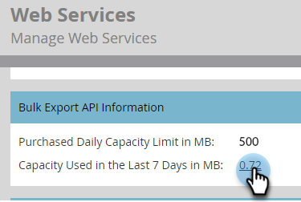

# 大量匯出API資訊 {#bulk-export-api-information}

了解如何檢查 [大量擷取API](https://developers.marketo.com/rest-api/bulk-extract/){target="_blank"} 過去七天來，您的Marketo Engage例項已使用容量。

>[!NOTE]
>
>如果您需要其他容量，請連絡您的客戶代表。

1. 前往 **管理** 的上界。

   

1. 按一下 **網站服務**.

   

1. 向下捲動至「Bulk Export API Information（批量導出API資訊）」卡。 按一下「最近7天」旁的數字，查看每日/API使用者的使用量。

   

   

>[!NOTE]
>
>您的Marketo Engage例項的配置每天在CST時間半夜12:00重設。
