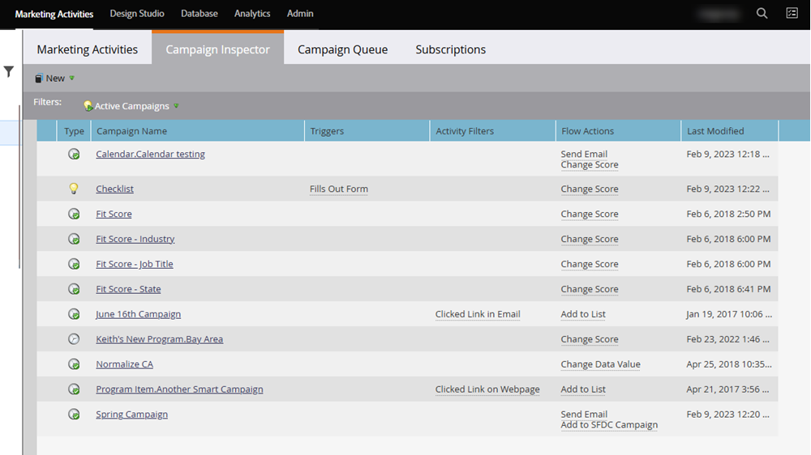
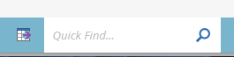

# Campaign Inspector {#campaign-inspector}

使用「行銷活動檢查程式」，在一個位置檢視/搜尋所有Smart Campaigns。

## 啟用Campaign Inspector {#enable-campaign-inspector}

1. 前往 **[!UICONTROL 管理員]** 區域。

   

1. 按一下 **[!UICONTROL 寶箱]**.

   

1. 按一下 **[!UICONTROL 編輯]** 「行銷活動稽核員」旁。

   

1. 選取 **[!UICONTROL 已啟用]** 核取方塊並按一下 **[!UICONTROL 儲存]**.

   

   >[!NOTE]
   >
   >需要在樹狀結構中選取所需的工作區，以便在啟用後檢視Campaign Inspector標籤。

## 使用Campaign Inspector {#using-campaign-inspector}

啟用後， Campaign Inspector標籤即可在行銷活動標籤旁邊找到。

按一下 **[!UICONTROL 作用中的行銷活動]** 下拉式清單，依不同型別的行銷活動篩選。

在頁面底部，存取搜尋列或匯出結果等實用工具。

