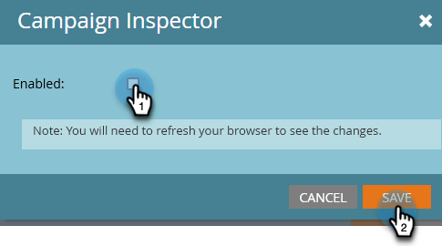

# 行銷活動檢查器 {#campaign-inspector}

使用「行銷活動檢視器」，在一個位置檢視及搜尋您的所有Smart Campaigns。

## 啟用Campaign檢查程式 {#enable-campaign-inspector}

1. 前往「**[!UICONTROL Admin]**」區域。

   

1. 按一下「**[!UICONTROL Treasure Chest]**」。

   

1. 按一下行銷活動檢查器旁的&#x200B;**[!UICONTROL Edit]**。

   

1. 選取&#x200B;**[!UICONTROL Enabled]**&#x200B;核取方塊並按一下&#x200B;**[!UICONTROL Save]**。

   

   >[!NOTE]
   >
   >需要在樹狀結構中選取所需的工作區，以便在啟用「行銷活動檢查器」標籤後檢視該標籤。

## 使用行銷活動檢視窗 {#using-campaign-inspector}

啟用後，您可以在「行銷活動」標籤旁邊找到「行銷活動檢查器」標籤。

按一下&#x200B;**[!UICONTROL Active Campaigns]**&#x200B;下拉式清單，依不同型別的行銷活動篩選。

在頁面底部，存取搜尋列或匯出結果等有用的工具。

