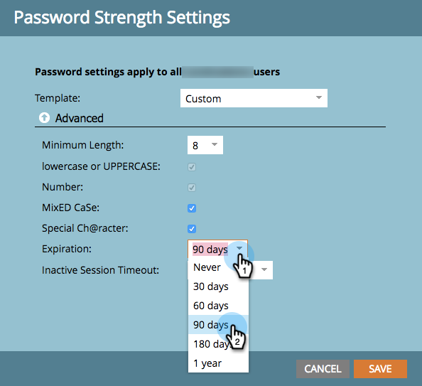

# 更改密碼安全設定 {#change-your-password-security-settings}

控制訂閱的密碼策略。 這是方法。

>[!NOTE]
>
>**需要管理權限**

1. 在 **管理**，按一下 **登入設定**.

   

1. 在 **安全設定**，按一下 **編輯**.

   

1. 選取 **範本**. 如需進階選項，請按一下 **進階** 下拉式清單。

   >[!NOTE]
   >
   >範本只是預先建立的設定。 標準是好的。 高安全性是最強的。 「自訂」可讓您自行建立。

   

   >[!TIP]
   >
   >在 **自訂**，核取方塊以指出您希望使用者建立密碼時包含的特性。

1. 設定 **過期**. 此功能會自動要求使用者在一段時間後重設密碼。 這也包括管理員使用者。

   >[!CAUTION]
   >
   >系統不會通知現有使用者變更。 設定 **過期** 請先變更為30天，以確保每個人都已更新至新設定，然後將此變更回原始順序。

   

1. 設定 **非作用中工作階段逾時**. 這會決定使用者在非作用中的時間長度，之後才必須重新登入Marketo。

   

   安全是嚴肅的事。 我們支援你。
