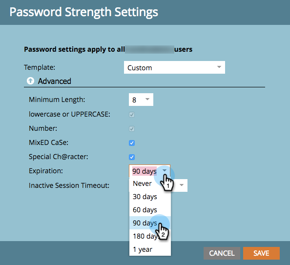

# 變更您的密碼安全性設定 {#change-your-password-security-settings}

控制訂閱的密碼原則。 方法如下。

>[!NOTE]
>
>**需要管理員權限**

1. 前往「**[!UICONTROL Admin]**」區域。

   

1. 按一下「**[!UICONTROL Login Settings]**」。

   

1. 在&#x200B;**[!UICONTROL Security Settings]**&#x200B;底下，按一下&#x200B;**[!UICONTROL Edit]**。

   

1. 選取&#x200B;**[!UICONTROL Template]**。 如需進階選項，請按一下&#x200B;**[!UICONTROL Advanced]**&#x200B;下拉式清單。

   

   >[!NOTE]
   >
   >範本只是預先建立的設定。 **[!UICONTROL Standard Security]**&#x200B;良好。 **[!UICONTROL High Security]**&#x200B;是最強的。 **[!UICONTROL Custom]**&#x200B;可讓您製作您自己的檔案。

   >[!TIP]
   >
   >在&#x200B;**[!UICONTROL Custom]**&#x200B;中，核取方塊以指出使用者建立密碼時要包含哪些特性。

1. 設定&#x200B;**[!UICONTROL Expiration]**。 此功能會自動要求使用者在一定時間長度後重設密碼。 這也包括管理員使用者。

   

   >[!CAUTION]
   >
   >變更不會通知現有使用者。 請先將&#x200B;**[!UICONTROL Expiration]**&#x200B;設定為30天，以確定所有人員都已更新為新設定，然後將此設定變回您的原始步調。

1. 設定&#x200B;**[!UICONTROL Inactive Session Timeout]**。 這會決定使用者在必須重新登入Marketo之前可以閒置多久。

   
