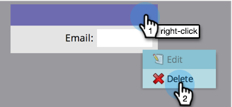

# 為「人員詳細資訊」頁建立自定義頁簽 {#creating-a-custom-tab-for-the-person-detail-page}

如果您發現自己一次又一次地在人員詳細資料中尋找特定的欄位集，請考慮建立自訂版面，讓事情更輕鬆。

1. 前往 **管理** 的上界。

   

1. 按一下 **欄位管理**.

   

1. 按一下 **自訂版面設計工具** 標籤。

   

1. 尋找您要新增的欄位，然後將其拖放至畫布中。

   

1. 繼續新增欄位，直到您的版面符合所需。

   

   >[!NOTE]
   >
   >您有兩個可使用的欄。

   如果您決定移除欄位，請以滑鼠右鍵按一下您要移除的欄位，然後按一下 **刪除**.

   

   太棒了！ 現在，當您載入人員的詳細資訊時，可以使用自訂版面來存取對您而言重要的資訊。

   
