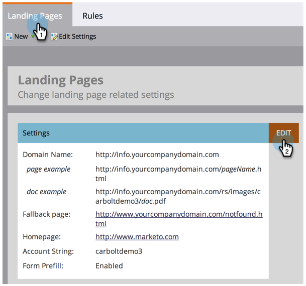

# 編輯著陸頁面設定{#edit-landing-page-settings}

您可以編輯您的網域名稱和備援頁面、啟用或停用表單預填、防止誤用您的登陸頁面等。 這是方法。

>[!NOTE]
>
>**需要管理員權限**

1. 在&#x200B;**Admin**&#x200B;下，按一下「著陸頁面」**。**

   

1. 在&#x200B;**著陸頁面**&#x200B;區段中，按一下&#x200B;**編輯**。

   

1. 輸入您的網域和頁面資訊。

   | 期限 | 定義 |
   |---|---|
   | 著陸頁面的網域名稱 | 這是您的CNAME。 CNAME是您為登陸頁面提供訪客之URL的第一部分。 例如，在`https://go.yourCompany.com`中，單字&quot;go&quot;是CNAME。 你可以有多個，但大多數人只是使用一個。 |
   | 備援頁面 | 如果著陸頁面不存在或關閉，此為前往的位置。 進一步瞭解[備援頁面](/help/marketo/product-docs/administration/settings/set-a-fallback-page.md)。 |
   | 首頁 | 輸入您的公司網站URL。 |

   

1. 勾選「表單預填」核取方塊，讓表單預填已知(Cookie)使用者的資訊。 ****&#x200B;取消選中以阻止。

   

1. 如果您想要防止惡意網站看似托管您的內容，請勾選「不允許將Marketo頁面嵌入外部網頁&#x200B;**」核取方塊。**

   

   >[!NOTE]
   >
   >如果您希望預填充`<script>`標籤出現在代碼中`<head>`標籤的結尾處，請選中&#x200B;**在頭尾處插入預填充指令碼**&#x200B;框。 如果您希望它出現在開頭，請保持未選中狀態。
   >
   >勾選&#x200B;**移除預設favicon連結**，以防止Marketo將任何favicon連結插入程式碼。

1. 選擇後，按一下「保存」。****

   

   幹得好！ 您的登陸頁面現在已具備正確的資訊，應立即開始運作。
