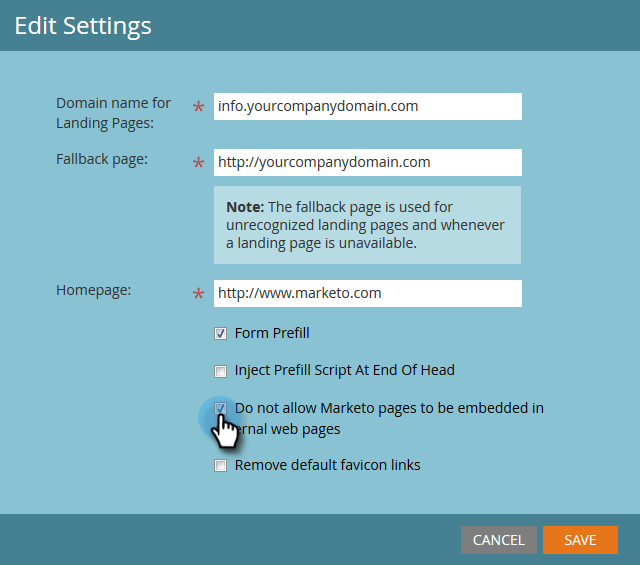

# 編輯登陸頁面設定 {#edit-landing-page-settings}

您可以編輯網域名稱和遞補頁面、啟用或停用表單預填、防止登陸頁面誤用等等。 方法如下。

>[!NOTE]
>
>**需要管理員許可權**

1. 前往 **[!UICONTROL 管理員]** 區域。

   

1. 按一下 **[!UICONTROL 登陸頁面]**.

   

1. 在 **[!UICONTROL 登陸頁面]** 區段，按一下 **[!UICONTROL 編輯]**.

   

1. 輸入您的網域和頁面資訊。

   

   | 詞語 | 定義 |
   |---|---|
   | [!UICONTROL 登陸頁面的網域名稱] | 這是您的CNAME。 CNAME是您為登陸頁面提供的網址(URL)的第一部分。 例如，在 `https://go.yourCompany.com`，單字「go」就是CNAME。 您可以有多個，但大多數人只使用一個。 |
   | [!UICONTROL 後援頁面] | 如果登入頁面不存在或已關閉，便可前往此處。 進一步瞭解 [後援頁面](/help/marketo/product-docs/administration/settings/set-a-fallback-page.md). |
   | [!UICONTROL 首頁] | 輸入您的公司網站URL。 |

1. 檢查 **[!UICONTROL 表單預填]** 核取方塊，允許表單預先填入已知（已編碼）人員的資訊。 取消勾選以封鎖。

   

1. 若要防止惡意網站看似託管您的內容，請檢查 **[!UICONTROL 不允許將Marketo頁面內嵌在外部網頁中]** 核取方塊。

   

   >[!NOTE]
   >
   >如果您想要預填 `<script>` 標籤的後面 `<head>` 標籤時，請檢查 **[!UICONTROL 在標題末尾插入預填指令碼]** 方塊。 如果您希望它顯示在開頭，請保持取消勾選狀態。
   >
   >檢查 **[!UICONTROL 移除預設的Favicon連結]** 防止Marketo將任何favicon連結插入程式碼中。

1. 進行選取後，按一下 **[!UICONTROL 儲存]**.

   

   做得好！您的登入頁面現在擁有正確的資訊，應該會立即開始運作。
