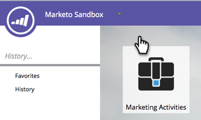
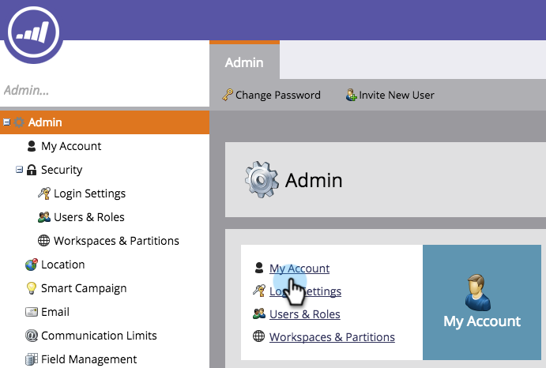
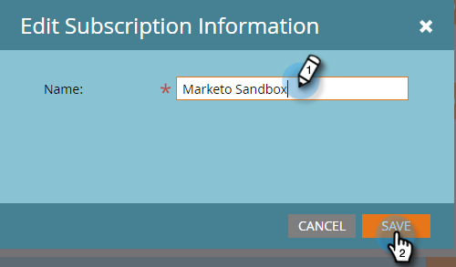

# 編輯訂閱設定{#edit-subscription-settings}

如果您有權存取多個Marketo訂閱，並想確定您使用的訂閱，請試著為每個訂閱提供唯一的名稱。 然後，該名稱會顯示在您的訂閱頁面頂端。

例如，如果您同時在生產與沙盒執行個體中工作，則可以為一個訂閱命名&#x200B;**Marketo生產**，而為另一個&#x200B;**Marketo沙盒**。

1. 前往&#x200B;**Admin**。

   

1. 按一下&#x200B;**My Account**。

   

1. 按一下&#x200B;**編輯訂閱資訊**。

   

1. 進行編輯，然後按一下「保存」。****

   

   再見！ 您的訂閱有新名稱。
