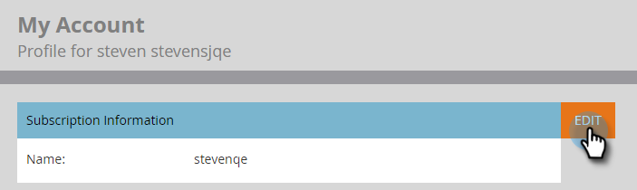

# 編輯訂閱設定 {#edit-subscription-settings}

如果您擁有多個Marketo訂閱的存取權，而且想確定您使用哪個訂閱，請嘗試為每一個訂閱指定唯一的名稱。 該名稱接著會顯示在您的訂閱頁面頂端。

例如，如果您在生產環境與沙箱執行個體中工作，您可以將一個訂閱命名為&#x200B;**Marketo生產環境**，將另一個&#x200B;**Marketo沙箱**&#x200B;命名。

1. 前往 **[!UICONTROL Admin]**。

   

1. 按一下「**[!UICONTROL My Account]**」。

   

1. 按一下「**[!UICONTROL Edit Subscription Information]**」。

   

1. 進行編輯並按一下&#x200B;**[!UICONTROL Save]**。

   
