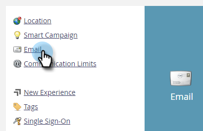

# 電子郵件追蹤連結標題 {#email-tracking-link-headers}

請依照下列步驟自訂您的電子郵件追蹤連結標題。

1. 在Marketo中，按一下 **管理**.

   

1. 按一下 **電子郵件**.

   

1. 向下捲動至「自訂標頭選項」。 選擇您想要的設定，然後按一下 **儲存變更**.

   

<table>
 <tr>
  <td><strong>嚴格傳輸安全</strong></td>
  <td>使用此功能可確保追蹤連結一律會透過HTTPS提供（僅應為具有SSL保護之追蹤連結的訂閱設定）</td>
 </tr>
</table>

>[!CAUTION]
>
>請務必與IT團隊一起檢閱這些設定，以決定您組織的原則應設定為什麼。 不正確的設定可能會使部分訪客無法存取您的電子郵件連結。
